> This project is an extension of my Master's thesis, *Load Balancing in Data Center Networks*. This repository presents the RTT-routing design, selected source code, and evaluation. **Full simulator code and experiment files: companion ns-3.48 repository — link to be added.**

# RTT-Aware Flowlet Routing for Datacenter Networks

**Can an approximate estimate of path delay be enough to make useful load-balancing decisions?**

Datacenter networks provide several routes between servers. ECMP assigns each connection to one route using a hash, but that route may become congested while another has spare capacity. The idea here is to use RTT estimates obtained from TCP timestamp information to steer bursts of packets toward lower-delay paths.

The original proposal has the leaf and spine switches write and read TCP timestamp information for the routing measurements. I simplified the ns-3 implementation by carrying timestamps and path information in packet tags, allowing me to study the RTT estimator and routing policies without first implementing that switch-side TCP timestamp handling. The prototype combines smoothed RTT estimates with probabilistic flowlet selection and supports fixed or RTT-derived timeouts. It runs in ns-3.48. The current 10 Gb/s ENT evaluation compares three RTT policies with CONGA and ECMP.

- [Design](#how-the-routing-works)
- [Code](#reading-the-code)
- [Experiments](#experimental-design)
- [Results](#results)
- [Validation](#engineering-and-validation)
- [Research direction](#why-i-did-not-pursue-publication)

## From thesis to implementation

My thesis explored incorporating **Power of Two Choices into CONGA's path selection**. The experiments did not improve on CONGA. Near the end of the thesis, I proposed a different approach: use TCP timestamp information to estimate RTT and bias flowlet placement toward less congested paths.

The underlying question was: **can an approximate indication of path conditions be good enough to make useful routing decisions?** I wanted to investigate whether smoothed RTT could supply that indication and guide probabilistic placement without reproducing CONGA's explicit fabric congestion-measurement and feedback mechanism.

CONGA itself uses an estimator and quantized feedback; its paper uses a 3-bit congestion metric by default. The distinction is therefore the source and meaning of the measurement, rather than an assumption that CONGA requires exact congestion information. Whether the RTT approach reduces implementation cost while retaining useful routing behavior remains an experimental question. See [CONGA, Sections 3.2 and 3.6](https://people.csail.mit.edu/alizadeh/papers/conga-sigcomm14.pdf).

This project develops the routing proposal into a working ns-3 module, using tags for its measurement and feedback implementation. My work includes:

- implementing a tag-based RTT measurement and feedback mechanism associated with the selected uplink;
- designing the probabilistic selection rule and integrating it with flowlet forwarding;
- comparing fixed and RTT-derived timeouts, along with alternative RTT selection policies;
- porting the CONGA comparison environment to ns-3.48;
- building shared-trace experiments, application-level correctness checks, and analysis notebooks.

The thesis compared against the older `Conga-ECMP` mode. The current evaluation uses a separate stable per-flow ECMP baseline, which performs substantially better in this setup. The earlier CONGA-versus-ECMP conclusions therefore need to be reassessed against this baseline.

## How the routing works

The source leaf keeps each active flowlet on its selected path. A new flow or an expired flowlet triggers a fresh selection using the available RTT estimates. Returning feedback updates those estimates for later decisions.

The flowchart shows the **implemented ns-3 data and ACK handling**. Tags carry the timing and path metadata; TCP timestamp handling is the intended counterpart in the original proposal.

~~~mermaid
flowchart TB
    subgraph forwarding["Flowlet forwarding at the source leaf"]
        packet["Outgoing data packet"] --> lookup["Identify flow and look up cached flowlet"]
        lookup --> active{"Flowlet exists and idle gap is within timeout?"}
        active -->|Yes| reuse["Keep cached uplink"]
        active -->|No| metrics["Read candidate RTT estimates"]
        metrics --> select["Select uplink using configured policy"]
        reuse --> record["Record uplink and last activity time"]
        select --> record
        record --> forward["Attach timestamp and path tag; forward data"]
    end

    subgraph measurement["RTT feedback at the source leaf"]
        feedback["ACK with valid RTT tag"] --> associate["Read original uplink and transmit time from tag"]
        associate --> sample["Calculate elapsed-time RTT sample"]
        sample --> smooth["Initialize estimate or update EWMA"]
        smooth --> estimates[("Per-uplink RTT estimates")]
    end

    estimates -.->|Selection input| metrics
    estimates -.->|Current uplink RTT when adaptive timeout is enabled| active

    classDef decision fill:#fff3cd,stroke:#997404,color:#332701;
    classDef routing fill:#dbeafe,stroke:#2563eb,color:#172554;
    classDef timing fill:#dcfce7,stroke:#16a34a,color:#14532d;
    class active decision;
    class packet,lookup,reuse,metrics,select,record,forward routing;
    class feedback,associate,sample,smooth,estimates timing;
~~~

The timeout is either fixed at 500 us or derived from the current uplink's effective RTT. A path without a measurement uses its configured base RTT. The feedback branch runs independently: updating an estimate does not immediately move an active flowlet.

### Scope and state

The design assumes a **two-tier leaf-spine topology**. For inter-rack traffic, the source leaf selects an uplink through the spine layer and retains that selection for the current flowlet.

The routing module maintains three kinds of state:

| State | Purpose |
| --- | --- |
| Uplink RTT estimates | Record the most recent sample and a smoothed estimate for each candidate uplink |
| Flowlet state | Record the selected port and previous packet activity time for each tracked flow |
| Packet state and tags | In the simulator, associate ACK feedback with the recorded transmission time and uplink |

In the evaluated two-leaf topology, each uplink identifies a candidate spine path to the other leaf. The current RTT estimates are **indexed by uplink port**, rather than by destination leaf and port together. Extending the design to several destination leaves requires checking whether that aggregation preserves the information needed for destination-specific decisions.

### RTT measurement and feedback

The motivation is that, within a fixed topology, propagation delay is relatively stable while queueing changes with load. An increase in measured RTT can therefore provide evidence of congestion.

The original proposal uses **TCP timestamp information from data packets and returning acknowledgements**, written and read by the leaf and spine switches, to obtain an RTT estimate for routing. This is the proposed switch-side measurement behavior. The simulation uses a simpler representation of the information needed by that proposal:

| Aspect | Original proposal | ns-3 implementation |
| --- | --- | --- |
| Timing information | TCP timestamps | Simulation times carried in `Ipv4RttTag` |
| Switch roles | Leaf and spine switches perform the proposed timestamp handling | Leaves create and process RTT tags; spines forward the packets |
| Feedback | Timestamp information associated with returning TCP acknowledgements | ACK tags constructed using packet state retained at the destination leaf |
| Association with a path | Match a measurement to the uplink that carried the data | Explicit uplink and leaf identifiers, with TCP sequence information |
| Routing decision | Smooth RTT estimates and use them to select a path at a flowlet boundary | Implemented by the RTT routing module |

The tag-based measurement proceeds as follows:

1. The source leaf selects an uplink and records the current simulation time and TCP sequence number. It attaches the timing and path information to the data packet as a tag.
2. The destination leaf retains this information in its packet-state table.
3. When an ACK arrives from the destination server, the destination leaf looks for matching recorded data state. Where available, it attaches that state's original timestamp and path information to the ACK.
4. When the tagged ACK reaches the source leaf, the source leaf calculates elapsed time and updates the estimate for the original uplink.

For this implementation, the sample is:

$$r_{i,\mathrm{sample}} = t_{\mathrm{feedback}} - t_{\mathrm{send}}.$$

Here, $t_{\mathrm{send}}$ is the time the data packet leaves the source leaf, and $t_{\mathrm{feedback}}$ is the time the tagged ACK returns there. The sample therefore includes the outward journey from that leaf, destination-server/ACK handling, and the return journey to the leaf. It is not the RTT estimate maintained by the sending server's TCP socket.

The original uplink comes from the tag rather than the flow's current route. If a flowlet has moved while feedback was in flight, the measurement still updates the uplink used by the recorded transmission.

The tags are simulation metadata. They provide a convenient way to evaluate the routing rule, but do not implement TCP timestamp-option processing or establish its resolution, path matching, or interaction with endpoint TCP behavior. Those are implementation and validation tasks for the timestamp-based proposal. The UDP/telemetry feedback discussed later is a further extension beyond that proposal.

RTT remains an **indirect congestion signal**: it combines forward-path, return-path, and ACK-handling delay. A rise in RTT can inform path selection, but does not directly identify which forward link or queue caused it.

### Smoothing the measurements

The routing module smooths successive samples using an exponentially weighted moving average (EWMA). For uplink $i$, let:

- $r_i^{(t)}$ denote the newest sample;
- $\hat r_i^{(t-1)}$ denote the previous smoothed estimate;
- $\alpha$ denote the weight assigned to the new sample.

The update is:

$$\hat r_i^{(t)} = (1-\alpha)\hat r_i^{(t-1)} + \alpha r_i^{(t)}.$$

The main experiments use $\alpha=0.125$. Each update therefore retains 87.5% of the previous estimate and assigns 12.5% to the new sample. A larger value reacts faster to changing delay; a smaller value retains more history and suppresses more short-term variation.

For example, a previous estimate of 100 us and a new sample of 180 us produce:

$$\hat r_i^{(t)} = 0.875(100)+0.125(180)=110\ \mu s.$$

Before an uplink has a measurement, `GetEffectiveRtt` returns its configured base RTT. The first sample initializes the smoothed estimate directly; subsequent samples use the EWMA. Thus, startup behavior depends on the configured base estimates, while later decisions use measured history.

### Flowlets and timeout choices

A **flowlet** is a burst of packets from a flow, separated from the next burst by a sufficiently long idle gap. Keeping the packets in a burst on one path reduces the frequency of route changes compared with per-packet routing.

Let:

$$\Delta t = t_{\mathrm{current}}-t_{\mathrm{previous}}$$

be the time between consecutive packets observed for a tracked flow. If the existing flowlet is still active, the module retains its selected port and updates its last activity time. A new flow or an expired flowlet triggers path selection.

The fixed-timeout configuration uses:

$$\tau_{\mathrm{fixed}}=500\ \mu s,\qquad\text{new flowlet if }\Delta t>\tau_{\mathrm{fixed}}.$$

The RTT-derived configuration uses the effective RTT estimate of the current uplink:

$$\tau_{\mathrm{RTT}}=\hat r_{\mathrm{current}},\qquad\text{new flowlet if }\Delta t>\tau_{\mathrm{RTT}}.$$

Before measurements exist, the effective estimate is the configured base RTT described above. At a gap equal to the timeout, the existing flowlet is retained.

The adaptive choice lets the switching threshold respond to observed delay. A shorter threshold permits more frequent reconsideration; a longer threshold retains paths across longer pauses. Neither is an ordering guarantee: packets remaining on a slow old path can overlap packets sent on a faster new path.

### Weighted RTT selection

The primary policy makes a **probabilistic** decision from the candidate RTT estimates. It favors lower-delay candidates without deterministically sending every new flowlet to the minimum-RTT port.

Suppose there are $n$ candidate estimates:

$$\hat r_1,\hat r_2,\ldots,\hat r_n.$$

First calculate their sum:

$$R=\sum_{i=1}^{n}\hat r_i.$$

Each candidate receives a complement score:

$$s_i=R-\hat r_i.$$

A lower RTT produces a larger score. Normalize the scores to obtain the selection probabilities:

$$S=\sum_{j=1}^{n}s_j,\qquad p_i=\frac{s_i}{S}.$$

For $n>1$ and $R>0$, the total score can also be written as:

$$S=(n-1)R,\qquad p_i=\frac{R-\hat r_i}{(n-1)R}.$$

This makes the probabilities sum to one. Equal positive estimates produce $p_i=1/n$. If the total score is zero, the implementation falls back to uniform selection; with one candidate, that candidate is selected.

#### Two-path example

Consider RTT estimates of 100 us and 200 us. Their sum is 300 us:

| Candidate | RTT estimate | Score | Selection probability |
| --- | ---: | ---: | ---: |
| Path 1 | 100 us | 300 − 100 = 200 | 200/300 = 2/3 |
| Path 2 | 200 us | 300 − 200 = 100 | 100/300 = 1/3 |

The lower-delay path is favored, but the second path remains available. These are probabilities for **flowlet placement**, not prescribed byte shares: flowlets can have different sizes.

The implementation converts RTT estimates to integer microseconds before calculating scores. It draws an integer from `0` through `S-1` and selects the candidate whose cumulative score interval contains that draw. Differences lost through microsecond quantization do not affect that selection.

With more candidates, the same formula remains valid, but its bias changes with $n$. For example, with nonnegative estimates and $n>1$, no probability exceeds $1/(n-1)$. The rule's behavior on a larger candidate set therefore needs evaluation rather than extrapolation from the two-path example.

### Alternative selection policies

The module includes alternative policies to study the effect of the selection rule while retaining the RTT measurement mechanism.

| Mode | Decision at a new flowlet |
| --- | --- |
| `WEIGHTED_ECMP` | Compute complement scores across all candidates and sample proportionally |
| `POWER_OF_2_RANDOM` | Sample two distinct candidates and select the lower-RTT candidate |
| `POWER_OF_2_TOP2` | Find the two lowest-RTT candidates, then choose one of those two with equal probability |
| `LOWEST_RTT` | Select the minimum-RTT candidate across the complete set |

Random-Two and Top-Two have different meanings. Random-Two samples before comparing RTTs; Top-Two examines the whole set to find the best two before choosing between them.

The main comparison includes Weighted RTT with both timeout choices and Random-Two with the RTT-derived timeout. Top-Two and Lowest-RTT are retained as experimental modes.

In the current two-spine topology, Random-Two samples the complete candidate set. This can test minimum-of-two behavior, but cannot demonstrate the usual benefit of sampling two paths from a much larger set.

### Decision logic

Detailed pseudocode: forwarding and RTT updates

The following pseudocode summarizes the tag-based simulation. The routing rule consumes RTT estimates; timestamp extraction and ACK association are implemented by separate data and ACK handlers.

~~~text
On an outgoing data packet at the source leaf:
    identify the flow and its candidate uplinks
    look up the current flowlet

    if a flowlet exists:
        gap = now - flowlet.last_activity
        timeout = 500 us, or EffectiveRTT(flowlet.port)

        if gap <= timeout:
            port = flowlet.port
        else:
            port = SelectPort(candidates, policy)
    else:
        port = SelectPort(candidates, policy)

    record port and last_activity = now for the flowlet
    record packet state and attach the timestamp/path tag
    forward the packet through port

On an ACK with a valid RTT tag arriving at the originating leaf:
    port = tag.original_path
    sample = now - tag.transmit_time

    if port has no initialized RTT estimate:
        smoothed_rtt[port] = sample
    else:
        smoothed_rtt[port] =
            (1 - alpha) * smoothed_rtt[port] + alpha * sample
~~~

Measurement updates can continue within a flowlet. An updated estimate does not immediately move its next packet to another path; path choice is reconsidered when the flowlet boundary condition is met.

### Algorithmic cost

Let $P$ be the number of processed packets, $m$ the number of new flowlets, and $n$ the number of candidate paths. The following comparison concerns selection work with an available candidate list and constant-time access to candidate metrics.

| Policy | Selection work | Reason |
| --- | --- | --- |
| Hash-based ECMP | $O(1)$ per hash selection | Hash the flow and choose from the available candidates |
| Weighted RTT | $O(n)$ per new flowlet | Sum estimates, construct scores, and locate the sampled score interval |
| Random-Two | Expected $O(1)$ per new flowlet | Sample two distinct candidates and compare their estimates |
| Top-Two | $O(n)$ per new flowlet | Scan to identify the two minima |
| Lowest-RTT | $O(n)$ per new flowlet | Scan to identify the minimum |
| CONGA candidate selection | $O(n)$ per new flowlet | Compare candidate congestion metrics |

Random-Two is an expected-time statement because the implementation redraws the second candidate if it matches the first.

With constant-time packet bookkeeping, Weighted RTT's abstract total work is:

$$T(P,m,n)=O(P+mn).$$

The EWMA arithmetic for one sample is constant-time. For a fixed small $n$, the expression is linear in processed packets and flowlets, but that does not imply the same processing cost as ECMP.

The actual C++ implementation adds state lookup, routing lookup, packet/tag handling, and cleanup. It uses `std::map` for several tables, so their lookups are logarithmic in table size rather than constant-time. The expression above describes the selection and update model under its assumptions, not a complete runtime bound for the simulator.

State also extends beyond the candidate estimates: the module retains flowlet entries and packet state used to associate data with ACK feedback. These are costs of the current simulator implementation; the analysis above does not establish the cost of processing TCP timestamp options in hardware. No measured CPU, memory-scaling, or switch-ASIC cost comparison has been carried out.

## Reading the code

The RTT module implements the tag-based measurement mechanism and the routing policies described above. It does not implement the proposed processing of TCP timestamp options. Its main source files are:

| File or directory within the module | Role |
| --- | --- |
| `model/ipv4-rtt-routing.cc` and `.h` | RTT state, feedback handling, flowlet detection, and path selection |
| `model/ipv4-rtt-tag.cc` and `.h` | Simulation metadata carrying timestamps, leaf/path identifiers, and TCP sequence information |
| `helper/ipv4-rtt-routing-helper.cc` and `.h` | Installation and configuration through ns-3's routing helpers |
| `test/` | Routing-module regression tests |

### CONGA comparison source

The standard CONGA implementation is included alongside RTT routing so that readers can inspect the comparison baseline:

| Source | Role |
| --- | --- |
| [CONGA routing](src/conga-routing/model/ipv4-conga-routing.cc) and [header](src/conga-routing/model/ipv4-conga-routing.h) | Flowlet placement using local congestion estimates and remote feedback |
| [CONGA tag](src/conga-routing/model/ipv4-conga-tag.cc) and [header](src/conga-routing/model/ipv4-conga-tag.h) | Path and congestion-feedback metadata |
| [CONGA helper](src/conga-routing/helper/ipv4-conga-routing-helper.cc) and [header](src/conga-routing/helper/ipv4-conga-routing-helper.h) | Routing-protocol installation |
| [CONGA/ECMP experiment driver](scratch/Conga_ECMP.cc) | Shared topology, traffic replay, and measurements for CONGA and the separate per-flow ECMP baseline |
| [RTT experiment driver](scratch/rtt_1.cc) and [delivery accounting](scratch/trace-delivery.h) | RTT experiments and application-payload validation |

The thesis Power-of-Two CONGA variants are not included in this snapshot. The retained legacy `powerof2` option does not activate a selection policy in this CONGA source. RTT selection policies remain part of the RTT module.

These are source files for inspection; the complete build and simulator integration belong to the companion ns-3.48 repository. CONGA is adapted from [snowzjx/ns3-load-balance](https://github.com/snowzjx/ns3-load-balance), with project-specific porting and integration changes.

### Following the implementation

The main routines in `ipv4-rtt-routing.cc` connect the measurement, selection, and forwarding steps:

| Routine | Responsibility |
| --- | --- |
| `HandleOutgoingData` | Check the flowlet's activity time and retain its port or select a new one |
| `HandleIncomingData` | Retain the tagged data packet's timestamp and path information at the destination leaf |
| `HandleOutgoingAck` | Associate an ACK with retained data state and attach an RTT feedback tag |
| `HandleIncomingAck` | Calculate RTT from the returning tag and update its original uplink's estimate |
| `UpdatePortRtt` | Initialize or update the smoothed estimate for an uplink |
| `GetEffectiveRtt` | Retrieve the estimate used for selection and adaptive timeout decisions |
| `UpdateFlowlet` | Record the selected port and activity time |
| `SelectPort` | Dispatch to the configured selection policy |

The selection routines are `SelectWeightedPort`, `SelectPowerOf2Random`, `SelectPowerOf2Top2`, and `SelectLowestRttPort`. Their policy names correspond to the rules described above.

The helper installs the module through ns-3's routing-helper interface. In the full simulator repository, `scratch/rtt_1.cc` builds the topology, reads the traffic trace, applies policy settings, and attaches application-delivery and queue/link logging. Module regression tests are in `test/ipv4-rtt-routing-test-suite.cc`; transport tests and experiment-level payload checks run in the full simulator environment.

## Experimental design

All simulations were run on my personal **Dell Vostro laptop with an Intel Core i5-1235U processor and 16 GB of RAM**. These are the host machine's specifications; the simulated network is configured separately below.

The 10 Gb/s RTT experiments took **more than 24 hours of wall-clock time per simulation** on this laptop, despite a five-second traffic launch window. This limits the number of runs I can complete for each configuration.

The current topology has **two leaf switches, two spine switches, and four servers per leaf**. Each source leaf can reach the other leaf through either spine.

~~~mermaid
flowchart TB
    S0[Spine 0] --- L0[Leaf 0]
    S0 --- L1[Leaf 1]
    S1[Spine 1] --- L0
    S1 --- L1
    L0 --- H0["Hosts 0, 1, 2, 3"]
    L1 --- H1["Hosts 4, 5, 6, 7"]
~~~

| Setting | Current evaluation |
| --- | --- |
| Healthy server and fabric links | 10 Gb/s |
| Healthy oversubscription | 2:1 |
| Symmetric case | Equal-capacity fabric links |
| Asymmetric case | Leaf 0–Spine 0 starts at 5 Gb/s |
| CDF workloads | Data mining (DM) and enterprise (ENT) |
| Launch window | 0–5 s for every load |
| Drain period | 30 s after the final scheduled flow start; simulation ends at approximately 35 s |
| Link-utilization measurement window | 0–5 s |
| Symmetric offered loads | 0.1–0.9 |
| Asymmetric offered loads | 0.1–0.7 |
| CONGA settings | 500 us flowlet timeout; congestion estimates account for the reduced link capacity |
| TCP settings | SACK enabled; connection timeout 3 s |
| RTT-routing measurement | Leaf-observed elapsed time carried through data/ACK tags |

The capacity reduction represents a persistent asymmetry. An explicit failure of a physical member in an aggregate link is a separate experiment still to be evaluated.

### Comparison policies

| Policy | Placement rule | Flowlet timeout |
| --- | --- | --- |
| ECMP | Stable per-flow 5-tuple hash | No flowlet switching |
| CONGA | Congestion estimates and destination feedback | 500 us |
| RTT Weighted, fixed | RTT-biased probabilistic selection | 500 us |
| RTT Weighted, adaptive | RTT-biased probabilistic selection | Current uplink RTT estimate |
| RTT Random-Two, adaptive | Lower RTT of two sampled candidates | Current uplink RTT estimate |

The fixed-500-us Random-Two variant was tested in the earlier setup but excluded from the main comparison after it produced queue drops, exhausted TCP retries, and incomplete transfers.

### Traffic and measurements

The DM and ENT traces are generated using flow-size CDF points digitized from the CONGA paper, with Poisson arrivals and cross-leaf destinations. Every algorithm reuses the same trace for a given workload and load. Generation manifests record both requested and realized offered load, since a heavy-tailed sample can differ substantially from its target.

Earlier experiments used 100 Mb/s links and TrafPy's private-enterprise, commercial-cloud, university, and social-media-cloud benchmarks. The DM/ENT generator is independent of TrafPy.

**Application FCT** runs from the scheduled transfer start until the requested payload has arrived. Each transfer is checked against its input size. Incomplete transfers are reported separately and have no completion FCT; their exclusion from FCT statistics must be considered alongside the delivery results.

The analysis compares mean and tail FCT, forward TCP packet loss, application completion, queue drops, and link utilization. These measure different aspects of performance: a packet can be lost and retransmitted while its application still finishes correctly. The RTT comparisons evaluate the routing rule with tag-based feedback. They do not measure a deployed TCP-timestamp implementation. Repeated seeds and uncertainty estimates remain part of the validation plan.

## Results

The completed **enterprise (ENT)** experiments first establish CONGA and stable per-flow ECMP as baselines. The full comparison with three RTT policies follows below.

Both algorithms delivered every requested payload in all **32 runs**, with no missing, undersized, or oversized flows. This covers 73,256 transfers per algorithm in the symmetric sweep and 45,356 per algorithm in the asymmetric sweep. The FCT comparisons therefore include every input flow.

The overall mean FCT plots combine all flow sizes and show **mean algorithm FCT / mean CONGA FCT** for the same flows. CONGA is the reference at 1; an ECMP value of 2 means its mean completion time is twice CONGA's.

The normalized plots split by flow size show **mean CONGA FCT / mean ECMP FCT** instead. A value of 0.7 means a 30% lower mean FCT; ECMP is the horizontal reference at 1. Flow sizes are grouped as small (below 100 KiB), medium (100 KiB to below 1 MiB), and large (at least 1 MiB).

The horizontal axis uses the generator's **target load**, relative to the healthy fabric's aggregate 40 Gb/s capacity. Each load uses one independently generated trace, shared by both algorithms and both topologies where tested. Heavy-tailed flow sizes make the realized load differ from its target: for example, the 0.7 trace realizes approximately 0.767. The [traffic manifests](results/ent-10gbps/manifests) retain those values and seeds.

### Symmetric fabric

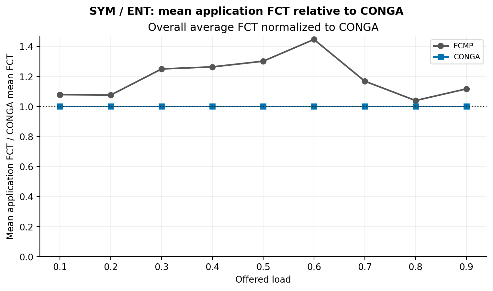

*Overall mean FCT across all flows at each load, with CONGA as the reference at 1.*

CONGA has lower mean FCT in every size class across loads 0.1–0.9. Its advantage varies with load: at 0.6, mean large-flow FCT falls from **200.4 ms with ECMP to 137.0 ms with CONGA**, a 31.6% reduction. At 0.8, the large-flow means are much closer.

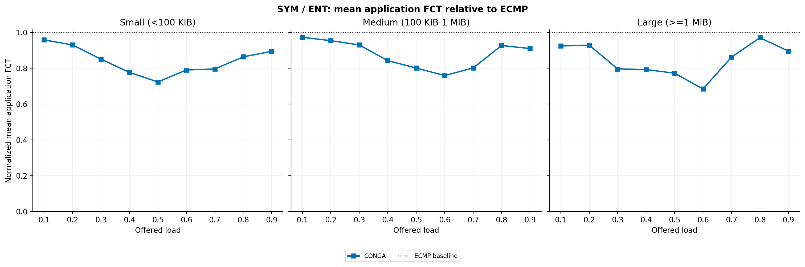

The absolute FCTs below show both the mean and the 99th percentile. The mean improvement does not extend to every tail result: CONGA's large-flow p99 is about 7% higher at loads 0.8 and 0.9, and its medium-flow p99 is slightly higher at 0.8.

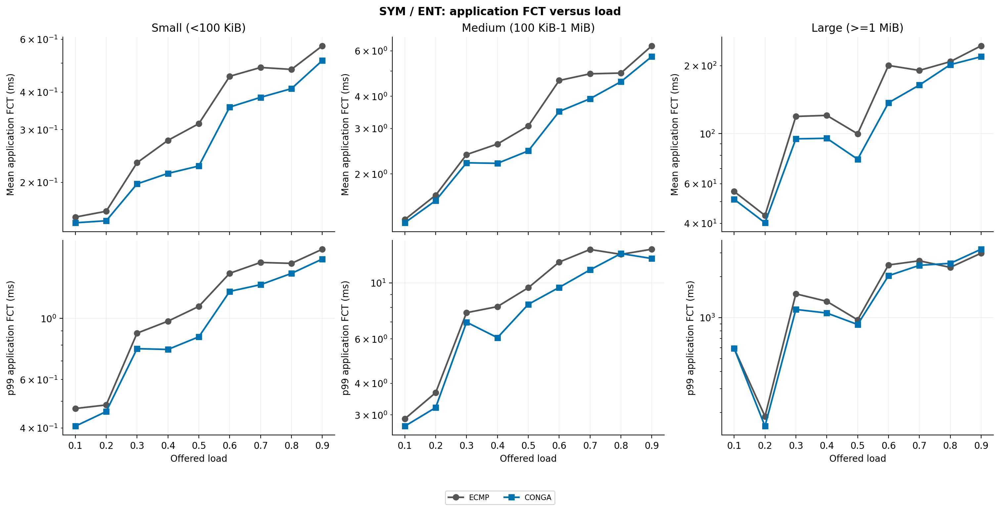

*Top row: mean FCT. Bottom row: p99 FCT. The vertical axes use logarithmic scales.*

### Asymmetric fabric

Here the Leaf 0–Spine 0 link operates at **5 Gb/s**, while the other links remain at 10 Gb/s. CONGA uses that reduced capacity in its congestion calculation. ECMP retains its per-flow hash placement.

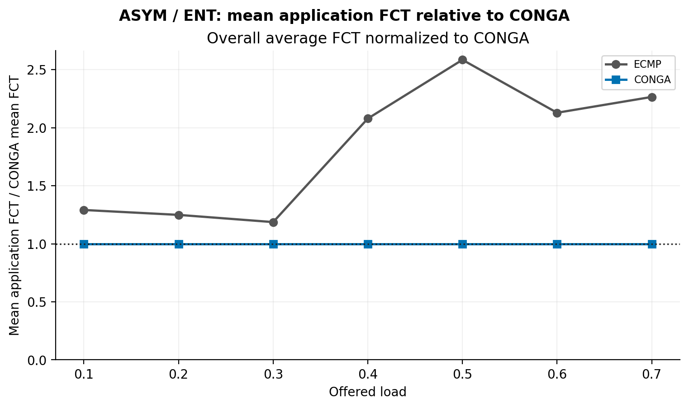

*Overall mean FCT across all flows at each load, with CONGA as the reference at 1.*

CONGA again has lower mean FCT in every size class, with larger gains for medium and large flows. At load 0.7, mean medium-flow FCT falls from **14.55 ms to 7.16 ms**, and mean large-flow FCT from **796.5 ms to 337.2 ms**—reductions of 50.8% and 57.7%, respectively. The small-flow mean improves by 8.9% at the same load.

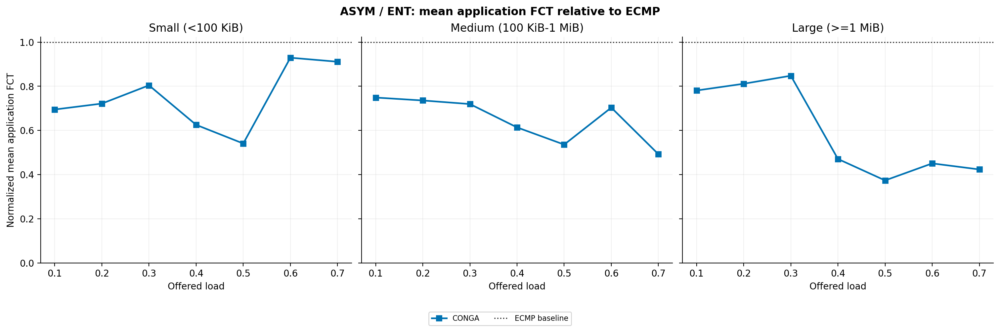

The tail improvements are also substantial at the upper loads. At 0.7, large-flow p99 falls from **6.81 s to 2.53 s**. The benefit is not uniform: medium-flow p99 is slightly worse with CONGA at 0.3, and small-flow mean gains narrow at 0.6–0.7.

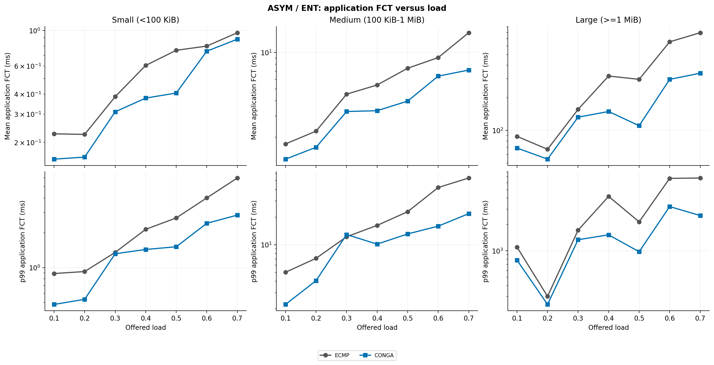

*Top row: mean FCT. Bottom row: p99 FCT. The vertical axes use logarithmic scales.*

### Delivery, packet loss, and queue drops

Both algorithms achieve **100% exact-size flow completion**. FlowMonitor records no forward TCP packet loss in the symmetric runs or in the asymmetric CONGA runs. Asymmetric ECMP records 26 lost forward packets at load 0.6 and 299 at 0.7. The latter is **0.00218% of transmitted forward packets**, so the loss is small in absolute terms even though it is visible in the plot.

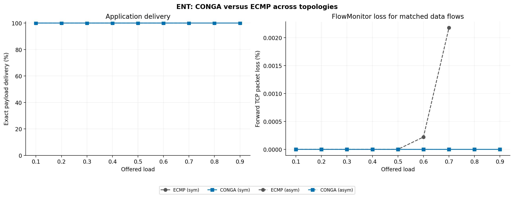

*The left panel is the percentage of flows whose delivered payload exactly matches the trace. All four series overlap at 100%. On the right, three series overlap at zero; asymmetric ECMP is the only nonzero series.*

The root FqCoDel counters record 26 drops at asymmetric ECMP load 0.6 and 311 at 0.7, with zero in the other runs. These counters cover all directions and flows, whereas the FlowMonitor figure selects the forward connections matched to the input transfers. They are separate measurements and should not be added together. Queue-drop figures are available for the [symmetric](results/ent-10gbps/sym/root_queue_drops_vs_load.png) and [asymmetric](results/ent-10gbps/asym/root_queue_drops_vs_load.png) sweeps.

The [run summary](results/ent-10gbps/run_summary.csv) contains completion, loss, and queue-drop counts for every case. [Result notes](results/ent-10gbps/README.md) identify the source notebook and supporting files.

These baseline results show a useful CONGA advantage in this ENT setup. They cover one trace and one routing run per load, two candidate paths, and a five-second launch window. Repeated seeds, larger fabrics, and the remaining workloads are needed to establish how consistently the gains carry over. This is not yet a reproduction of the original CONGA paper's evaluation.

### RTT routing against CONGA and ECMP

The completed ENT sweep compares all five policies in **80 runs**: symmetric target loads 0.1–0.9 and asymmetric target loads 0.1–0.7. Each policy uses the same input flow identities at a given load and topology. All runs delivered every requested payload exactly, and no flows were excluded from the FCT comparisons. The figures below show mean application FCT across all sizes, divided by CONGA's mean over those same flows.

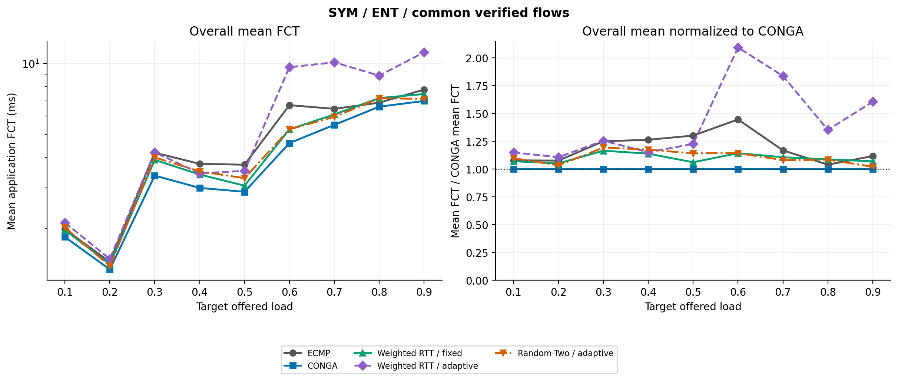

In the symmetric fabric, CONGA has the lowest overall mean FCT at every tested load. At load 0.9, Random-Two with an adaptive timeout averages **7.09 ms**, close to CONGA's **6.94 ms** and below ECMP's **7.76 ms**. The weighted RTT policy with an adaptive timeout falls behind the other policies at higher loads.

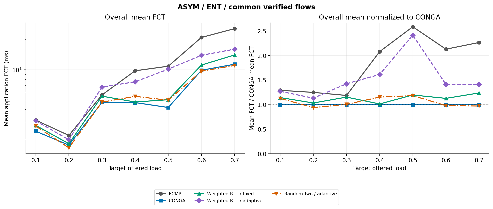

In the asymmetric fabric, Random-Two with an adaptive timeout has the lowest overall mean FCT at loads **0.2, 0.6, and 0.7**. At 0.7 it averages **11.05 ms**, compared with **11.37 ms** for CONGA and **25.76 ms** for ECMP. The tail result differs: Random-Two's overall p99 is **290 ms**, versus **233 ms** for CONGA. Mean and tail FCT by flow size are shown below.

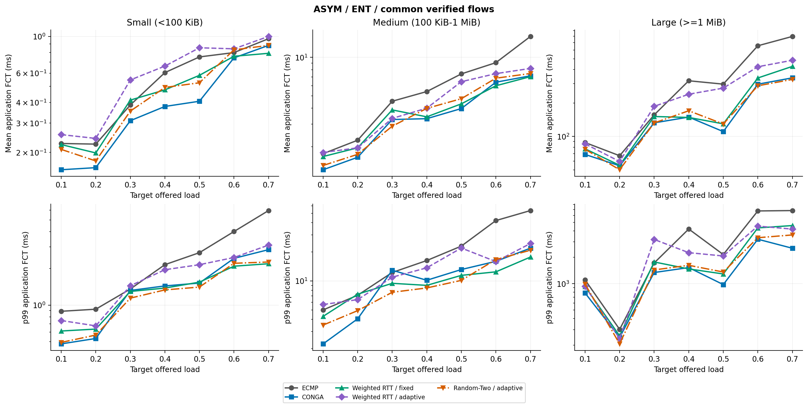

The three RTT policies have **no recorded forward TCP packet loss or queue drops** in these runs. ECMP has 26 and 299 lost forward packets at asymmetric loads 0.6 and 0.7, respectively; all flows still finish with the requested payload. The figure uses FlowMonitor's forward-connection loss counters.

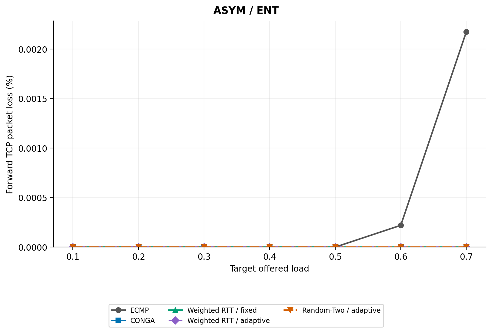

The [illustrated results notebook](analysis/rtt_cdf_10gbps_5s_results.ipynb) contains **all 65 figures with explanations**, including every load's FCT distribution, tail, and individual-link utilization. The [figure index](results/ent-10gbps/rtt-full/ENT/20261008T074640_547349Z/INDEX.md), [FCT summary](results/ent-10gbps/rtt-full/ENT/20261008T074640_547349Z/fct_summary.csv), and [run validation](results/ent-10gbps/rtt-full/ENT/20261008T074640_547349Z/run_summary.csv) provide the underlying values. The [export notebook](analysis/compare_rtt_readme_cdf_10gbps_5s.ipynb) documents how the comparison was produced from the full simulator outputs.

These are single-trace, single-run comparisons in a two-path fabric. The RTT CSV logger understates utilization on the 5 Gb/s link because it uses a 10 Gb/s denominator; the exported heatmaps recalculate it from bytes and the physical capacity. This reporting issue does not affect FCT. Repeated seeds and larger fabrics are needed to test whether these patterns persist.

## Engineering and validation

The evaluation required checking more than whether the simulator completed a run. Several failures were visible only when application delivery was compared with the input trace.

| Area | Work completed |
| --- | --- |
| Porting | Integrated RTT routing, CONGA, and required global-routing extensions into ns-3.48 |
| TCP buffer state | Investigated SACK and connection-close crashes, added targeted corrections, and checked transport regression suites |
| Connection setup | Traced a duplicate-payload reproduction to delayed SYN/retry behavior under a 5-ms timeout; restoring the 3-second timeout removed that reproduced failure |
| Simulation deadlines | Kept receivers active through the drain period and scaled the stop time with the traffic window |
| Simulation timestamps | Replaced the RTT tag's timestamp representation, which overflowed after about 2.147 s, with 64-bit nanoseconds |
| CONGA integration | Corrected hash inputs, duplicate candidates, missing-table handling, and reduced-link capacity accounting |
| Flow validation | Added requested/sent/received payload accounting and independent per-flow cross-checks |

The full build and all **43 TCP test suites** passed during the transport investigation. Routing-specific checks and comparison with the original CONGA evaluation remain ongoing.

Some earlier asymmetric CONGA cases still require explanation. Queueing, path selection, loss, and reordering are possible contributors; reordering has not been established as the cause. These questions are retained in the simulator repository's investigation reports so that conclusions stay tied to the configuration actually tested.

## Reproducing the experiments

The work is organized into three repositories:

| Repository | Purpose |
| --- | --- |
| **RTT routing — this repository** | The RTT module and design, CONGA comparison source, experiment drivers, and selected evaluation figures and analysis |
| **Modified ns-3.48** | The complete runnable simulator, including RTT routing, CONGA, ECMP, experiment drivers, input traces, automation scripts, and validation tools |
| **TrafPy fork** | Compatibility fixes and generation code for the TrafPy benchmark workloads |

Use this repository to explore the RTT design and its evaluation. Use the full ns-3.48 repository to reproduce an experiment. The TrafPy fork is needed only to regenerate its benchmark traces; replaying an existing trace does not require TrafPy.

**TrafPy fork:** link to be added. The full simulator link will be added to the opening note above.

### Running the experiments

**Run simulations from the full ns-3.48 repository.** That checkout contains the integrated transport changes, comparison algorithms, experiment drivers, and traffic inputs needed to reproduce the setup.

For the current CDF experiments, build the simulator and generate the inputs once:

~~~bash
./ns3 configure --enable-examples --enable-tests
./ns3 build
./generate_cdf_traffic_10gbps_5s.sh
~~~

Then select the appropriate runner:

| Scenario | RTT policies | CONGA or ECMP |
| --- | --- | --- |
| Symmetric | `./rtt_sym_cdf_10gbps_5s_all.sh` | `./conga_sym_cdf_10gbps_5s_all.sh` |
| Asymmetric | `./rtt_asym_cdf_10gbps_5s_all.sh` | `./conga_asym_cdf_10gbps_5s_all.sh` |

These runners sweep loads 0.1–0.9 for the symmetric fabric and 0.1–0.7 for the asymmetric fabric. The CONGA/ECMP scripts prompt for DM or ENT and run both policies by default; an optional second argument selects `Conga` or `ECMP`. The RTT scripts also prompt for the policy group. For the ENT baseline results above, run:

~~~bash
./conga_sym_cdf_10gbps_5s_all.sh ENT
./conga_asym_cdf_10gbps_5s_all.sh ENT
~~~

Reuse the generated inputs across policies. In `8_hosts_v9(prob1)/compare_conga_ecmp_cdf_10gbps_5s.ipynb`, select `WORKLOAD = "ENT"` to check the CONGA/ECMP baselines. Run `8_hosts_v9(prob1)/compare_rtt_readme_cdf_10gbps_5s.ipynb` to validate and export the five-policy comparison; the copied notebook is under [analysis](analysis/). Both support `"DM"` when its outputs are available. Analysis reads saved results; it does not launch simulations.

To regenerate the earlier TrafPy benchmarks, use the separate TrafPy repository and its documented environment. Exact repository revisions will accompany the published results.

## Why I did not pursue publication

I initially intended to develop the thesis proposal into a paper. The original design had a specific measurement mechanism: have the leaf and spine switches use TCP timestamps and acknowledgement traffic to obtain RTT estimates for path selection. The question that led me away from publishing this version was **how broadly that TCP-dependent mechanism could serve a datacenter network**.

RoCEv2 carries RDMA over UDP, so it cannot directly supply the TCP timestamp and ACK feedback assumed by the proposal. Extending the routing idea to that traffic requires another source of measurements. This limitation concerns the proposed measurement source; replacing TCP timestamp handling with tags in ns-3 was a simulation simplification, not a solution to the transport dependency.

The prototype lets me evaluate the selection rule, timeout choices, and feedback behavior. A TCP-timestamp implementation would still need to establish timestamp resolution, reliable association with the original path, and compatibility with endpoint TCP behavior. The simulator results alone do not answer those deployment questions.

I decided not to pursue publication of this version while continuing its implementation and evaluation as an extension of my thesis. The work provides a basis for studying RTT-based placement and exploring a measurement mechanism that also serves other transports. Larger fabrics, repeated seeds, and validation of the comparison algorithms remain necessary before making general performance claims.

### A direction worth exploring

A possible extension is to replace the dependency on TCP timestamp and ACK traffic with a transport-independent measurement exchange between leaves. A leaf could timestamp sampled packets or probes, and the destination leaf could return an identified path-delay estimate. Feedback could be piggybacked on reverse traffic, as in CONGA, with explicit UDP messages when reverse traffic is unavailable. Periodic refreshes could be supplemented by rate-limited updates when congestion changes, including when a path recovers.

For one-way delay, this proposal would require **PTP-synchronized clocks**, suitable timestamp placement, and a quantified synchronization error. Echo-based RTT measurements would avoid the cross-device synchronization requirement, but include reverse-path and response delay. The distinction follows the [one-way](https://www.rfc-editor.org/rfc/rfc7679.html) and [round-trip](https://www.rfc-editor.org/rfc/rfc2681.html) delay definitions.

This measurement layer could use **INT, IOAM, or other in-band telemetry** to expose timing, path, and queue information. [IOAM](https://www.rfc-editor.org/rfc/rfc9197.html), for example, defines fields for such observations. A new routing algorithm could use the feedback for path placement while [DCQCN](https://www.microsoft.com/en-us/research/publication/congestion-control-for-large-scale-rdma-deployments/) regulates RoCEv2 sender rates using ECN feedback.

Two papers provide useful starting points for this direction:

- **EAR — [Combining ECN and RTT for Datacenter Transport (APNet 2017)](https://conferences.sigcomm.org/events/apnet2017/papers/ear-zeng.pdf).** EAR combines ECN's indication of individual queue congestion with RTT's indication of accumulated delay in a transport window-control mechanism.
- **ECN# — [Enabling ECN for Datacenter Networks with RTT Variations (CoNEXT 2019)](https://baiwei0427.github.io/papers/ecn-conext2019.pdf).** This work examines how variation in base RTT complicates ECN threshold selection. Its switch marking scheme combines responses to instantaneous congestion and persistent queueing; it does not require continuous measurement of each flow's base RTT.

Together, these papers motivate considering both the information a signal provides and how the controller reacts to it. EAR operates at the transport controller, while ECN# changes switch marking. The proposed path-selection design would require its own control rule and evaluation alongside those mechanisms.

A related perspective comes from [**PINT: Probabilistic In-band Network Telemetry**](https://arxiv.org/pdf/2007.03731), which I encountered after developing this approach. PINT uses probabilistic encoding and approximation to limit per-packet telemetry overhead. Its premise aligns with my original motivation: the consumer of a measurement may need enough information to make a useful decision, rather than a complete account of every packet at every hop.

PINT approximates telemetry collected inside the network; this prototype uses RTT as an indirect congestion signal. Its findings therefore motivate the question without validating this routing rule. A future evaluation could vary measurement resolution, sampling frequency, and feedback age to establish how much information the routing policy actually needs. PINT-style telemetry could also be explored as a measurement source for the transport-independent extension.

The research question would then be how to coordinate path placement and rate control using those measurements. Feedback overhead, stale estimates, clock error, packet ordering, and interaction between the two control loops would need to be measured. This extension is a proposed direction, not part of the current implementation.

## Attribution

The RTT-routing design and its implementation extend my Master's thesis work. The CONGA comparison code is adapted from [snowzjx/ns3-load-balance](https://github.com/snowzjx/ns3-load-balance); credit for the CONGA algorithm belongs to the authors of [*CONGA: Distributed Congestion-Aware Load Balancing for Datacenters*](https://people.csail.mit.edu/alizadeh/papers/conga-sigcomm14.pdf).

The TrafPy workload models and ns-3 simulator are the work of their respective authors. My companion repositories contain the project-specific generation code, compatibility changes, simulator integration, and validation work. Upstream licenses and attribution notices are retained.

**Hemadri Shekhar Das**  
Chennai Mathematical Institute
