# ENT: RTT, CONGA, and ECMP comparisons

Export: 20261008T074640_547349Z. All 80 selected runs passed the flow-validation gate.
The total flow-record count includes one record per input flow per algorithm/topology run.

See [configuration](configuration.json), [run validation](run_summary.csv), [findings](issues.csv), [FCT statistics](fct_summary.csv), and [cohorts](cohorts.csv).

Figures describe individual simulation runs; no repeated-seed uncertainty intervals are claimed.
Relative FCT below one means lower FCT than the named baseline. Link utilizations have separate denominators and do not sum to 100%.

## Suggested figures for the README

- [SYM: Overall mean application FCT](sym/overall_mean_fct_vs_load.png)
- [SYM: Mean and p99 FCT by flow size](sym/fct_vs_load.png)
- [SYM: Size-class mean FCT relative to ECMP](sym/normalized_mean_fct_vs_load.png)
- [SYM: Forward TCP packet loss](sym/forward_packet_loss_vs_load.png)
- [ASYM: Overall mean application FCT](asym/overall_mean_fct_vs_load.png)
- [ASYM: Mean and p99 FCT by flow size](asym/fct_vs_load.png)
- [ASYM: Size-class mean FCT relative to ECMP](asym/normalized_mean_fct_vs_load.png)
- [ASYM: Forward TCP packet loss](asym/forward_packet_loss_vs_load.png)

## Full figure set

### WORKLOAD: Input flow sizes and realized load

Left: an empirical flow-size CDF, where each requested flow has equal weight. Middle: the cumulative fraction of requested payload bytes in flows up to each size; large flows dominate this byte-weighted view. Right: realized payload arrival load versus the target. Both topologies reuse the same trace at a given load. The denominator is the healthy fabric's aggregate directed uplink capacity (40 Gb/s in this setup), including for asymmetric runs. Five-second sampling of a heavy-tailed distribution can give a realized load above or below its target. These curves describe the input traces, not routing performance.

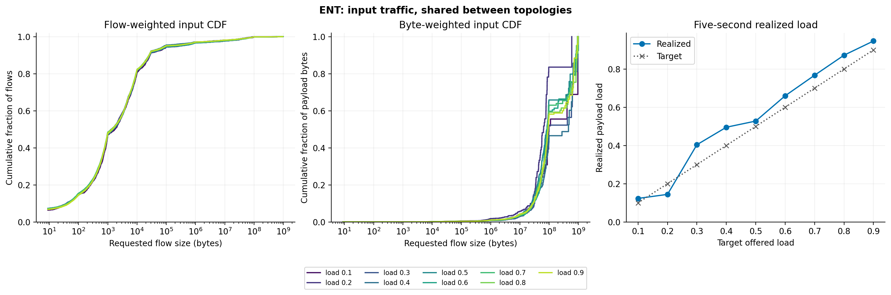

[SVG version](workload/input_workload.svg)

### SYM: Application delivery and validation

All requested flows are counted. The panels show exact-size deliveries, missing application bytes, and flows with any validation finding. Unknown receive counts are unavailable rather than zero. The figure gate also requires every independent sink audit and flow match to pass. The last two axes use a linear region around zero, followed by logarithmic scaling.

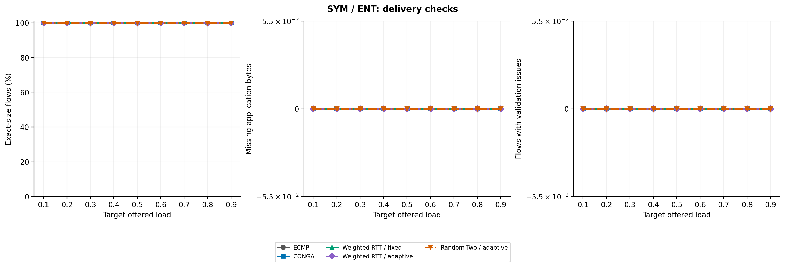

[SVG version](sym/payload_delivery_vs_load.svg)

### SYM: Packet loss and queue drops

The panels show forward FlowMonitor loss, root queue-disc drops across all interfaces and directions, root drops per delivered MiB, and device-queue drops. These counters have different scopes and may refer to overlapping packet events; do not add them. Root FqCoDel drops may represent queue management, not merely a physically full device queue. Event-stage and reason tables are exported under each topology's summary folder. Coincident zero-valued curves can cover one another.

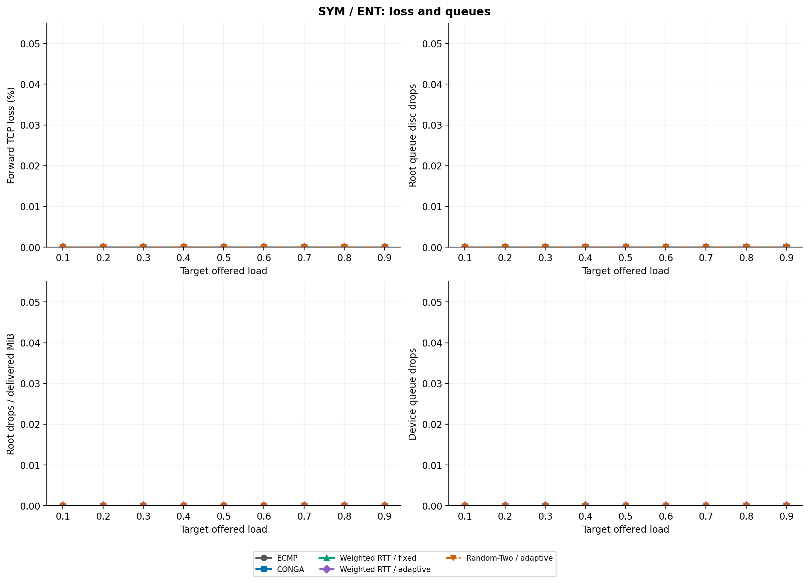

[SVG version](sym/packet_loss_and_queue_drops.svg)

### SYM: Overall mean application FCT

The left panel shows the arithmetic mean over all input flows, in milliseconds on a logarithmic axis. The right divides each mean by CONGA's mean for the same flows; lower is better and one equals CONGA. Small and large transfers each contribute one FCT value. The overall mean is not an average of the size-class means. Compare within a topology; asymmetric experiments have less capacity.

[SVG version](sym/overall_mean_fct_vs_load.svg)

### SYM: Mean and p99 FCT by flow size

Columns split flows at 100 KiB and 1 MiB; rows show the arithmetic mean and sample p99. The vertical axes are logarithmic and may have different scales. Inspect large-flow behavior separately from small-flow latency. The fct_summary.csv file records the sample count for each class; a p99 from a small class depends on very few flows.

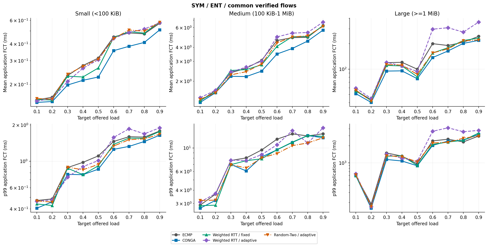

[SVG version](sym/fct_vs_load.svg)

### SYM: Size-class mean FCT relative to ECMP

Each point is mean(policy FCT) / mean(ECMP FCT) in the same size class and matched cohort. Below one means a lower mean FCT than ECMP; above one means a higher mean. This is a ratio of means, not the mean of individual flow ratios. The denominator is ECMP, unlike the overall normalized panels.

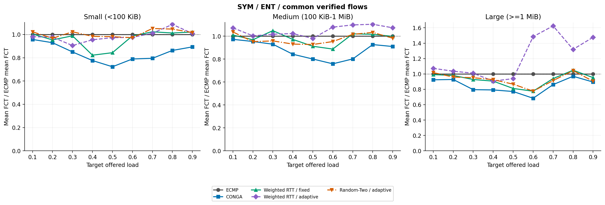

[SVG version](sym/normalized_mean_fct_vs_load.svg)

### SYM: Overall p99 application FCT

The left panel is the sample 99th percentile over all flow sizes. The right is the ratio of that percentile to CONGA's percentile for the same input-flow cohort. A larger mean improvement can coexist with a worse p99. These are quantiles of one simulation's flow population, not confidence intervals across repeated runs.

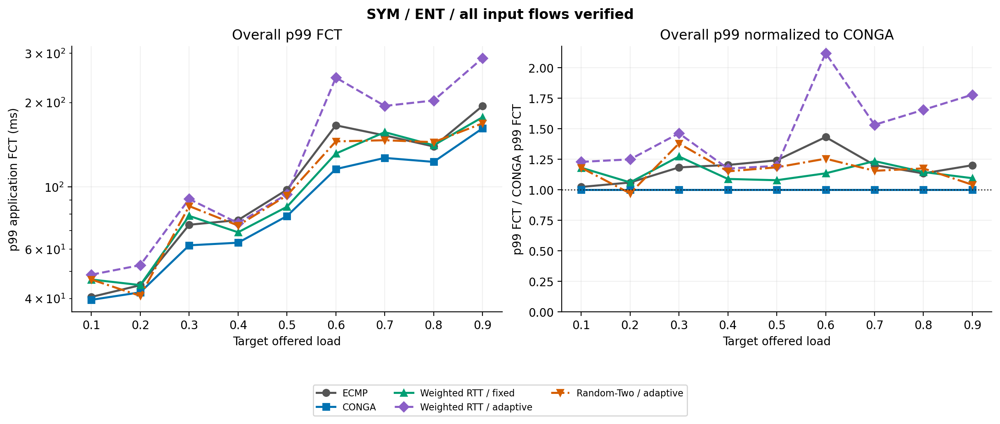

[SVG version](sym/overall_p99_fct_vs_load.svg)

### SYM: Size-class p99 FCT relative to ECMP

Each point divides the policy's sample p99 by ECMP's sample p99 over the same size class and flow cohort. Below one means a lower tail percentile. A p99 ratio is not the 99th percentile of per-flow speedups, and it does not describe run-to-run uncertainty.

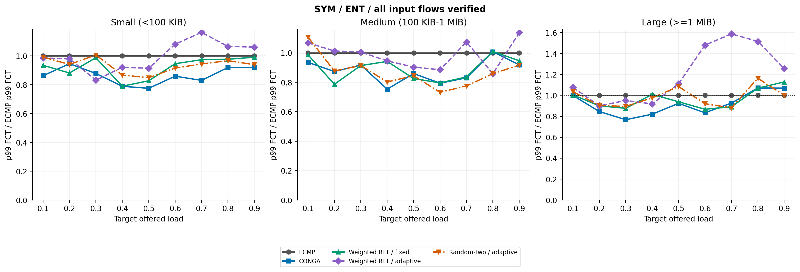

[SVG version](sym/normalized_p99_fct_vs_load.svg)

### SYM: Forward TCP packet loss

FlowMonitor lost packets divided by transmitted packets, multiplied by 100, for forward TCP connections matched uniquely to the input flows. This includes connection-control traffic on those connections; it is not a fraction of missing payload bytes or a count of all retransmissions. Zero means no recorded forward losses under this counter.

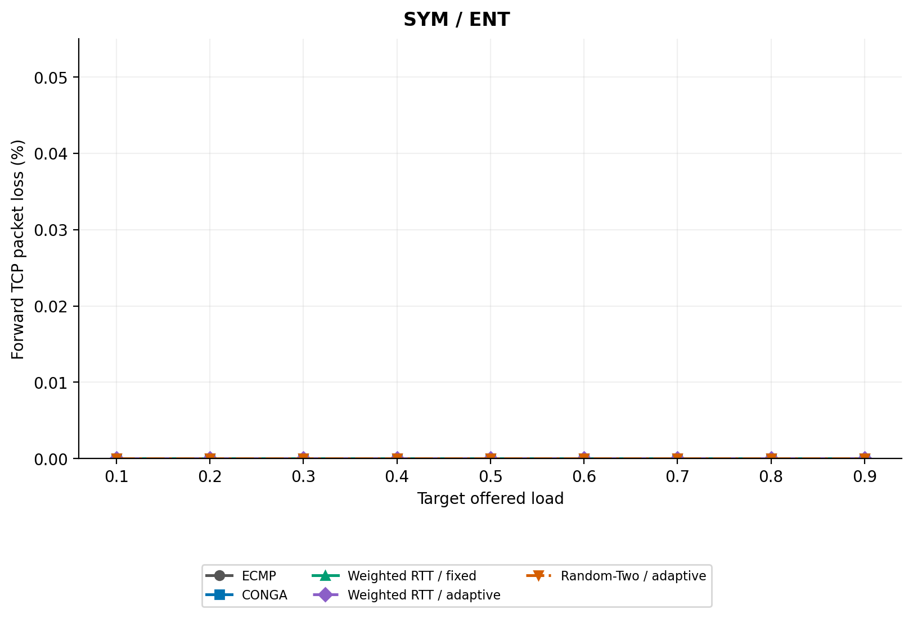

[SVG version](sym/forward_packet_loss_vs_load.svg)

### SYM / load 0.1: Per-load FCT distribution

Within each size class, the vertical value is the fraction of verified completed flows with application FCT at or below the horizontal value. The horizontal scale is logarithmic; a curve further left reaches a given completion fraction sooner. Step shapes, especially for a small large-flow population, are expected. Each panel gives its number of flows per policy; no sizes are pooled across classes.

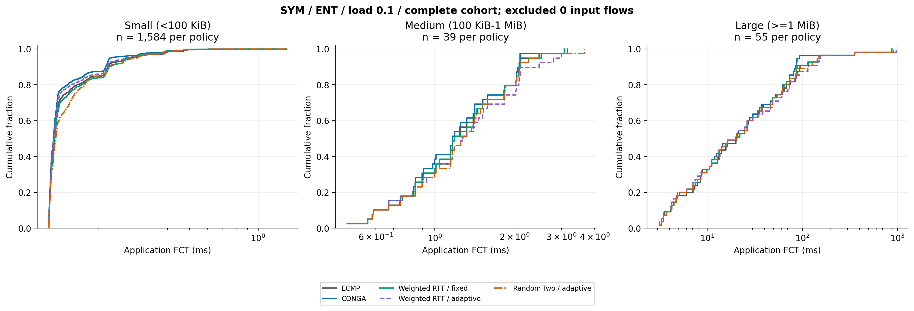

[SVG version](sym/load_1/fct_cdf.svg)

### SYM / load 0.1: Per-load directed uplink utilization

Each cell is bytes transmitted on that leaf-to-spine link during 0–5 s, divided by that individual link's capacity over five seconds. Cells are not shares of a single total and do not sum to 100%. The reduced Leaf 0–Spine 0 link uses 5 Gb/s for asymmetric runs. Other links use 10 Gb/s. The same color scale is used across all exported heatmaps. Traffic during drain is excluded; these averages do not reveal instantaneous queueing or prove packet reordering.

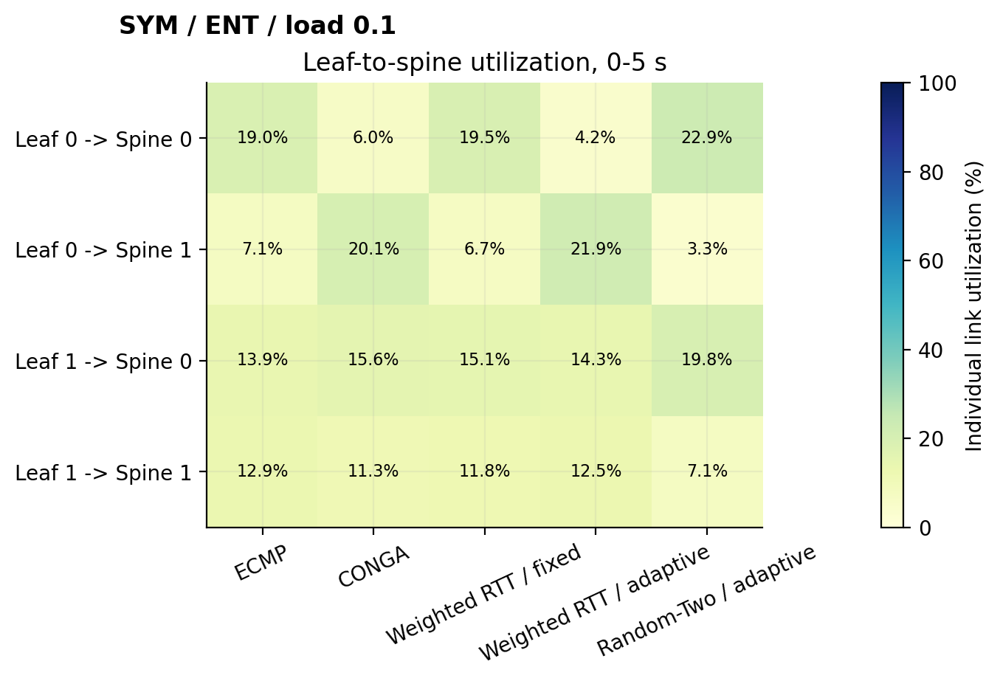

[SVG version](sym/load_1/uplink_utilization.svg)

### SYM / load 0.1: Per-load FCT tail

The complementary CDF shows the fraction with application FCT strictly greater than the horizontal value, using logarithmic axes. At a fixed threshold, lower means fewer flows exceed it. The dotted 0.01 reference marks a one-percent tail. Ties are counted together and the zero-probability endpoint is omitted; a curve ending before another is not an incomplete transfer. Sample counts are shown, and the ordinary CDF remains available alongside this view.

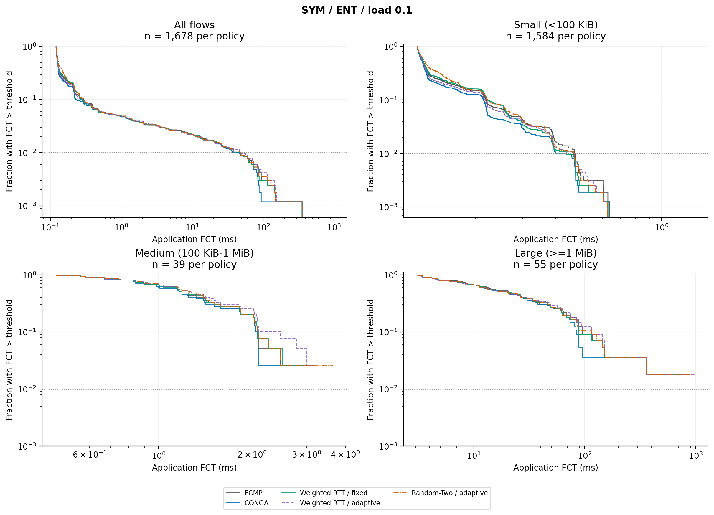

[SVG version](sym/load_1/fct_tail.svg)

### SYM / load 0.2: Per-load FCT distribution

Within each size class, the vertical value is the fraction of verified completed flows with application FCT at or below the horizontal value. The horizontal scale is logarithmic; a curve further left reaches a given completion fraction sooner. Step shapes, especially for a small large-flow population, are expected. Each panel gives its number of flows per policy; no sizes are pooled across classes.

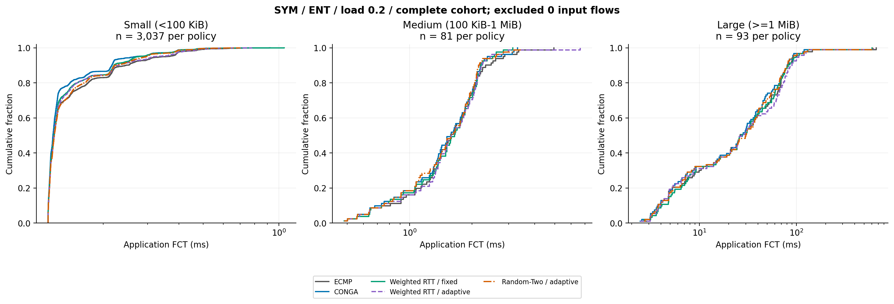

[SVG version](sym/load_2/fct_cdf.svg)

### SYM / load 0.2: Per-load directed uplink utilization

Each cell is bytes transmitted on that leaf-to-spine link during 0–5 s, divided by that individual link's capacity over five seconds. Cells are not shares of a single total and do not sum to 100%. The reduced Leaf 0–Spine 0 link uses 5 Gb/s for asymmetric runs. Other links use 10 Gb/s. The same color scale is used across all exported heatmaps. Traffic during drain is excluded; these averages do not reveal instantaneous queueing or prove packet reordering.

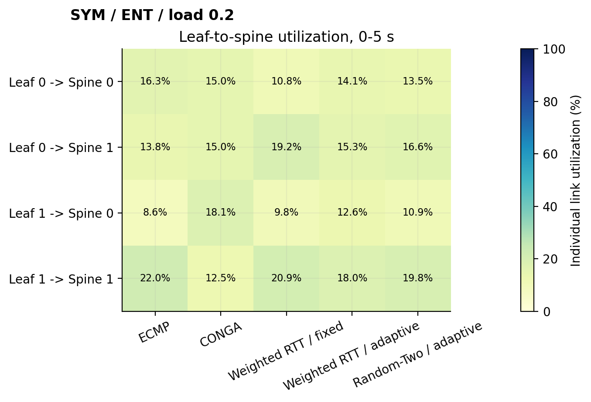

[SVG version](sym/load_2/uplink_utilization.svg)

### SYM / load 0.2: Per-load FCT tail

The complementary CDF shows the fraction with application FCT strictly greater than the horizontal value, using logarithmic axes. At a fixed threshold, lower means fewer flows exceed it. The dotted 0.01 reference marks a one-percent tail. Ties are counted together and the zero-probability endpoint is omitted; a curve ending before another is not an incomplete transfer. Sample counts are shown, and the ordinary CDF remains available alongside this view.

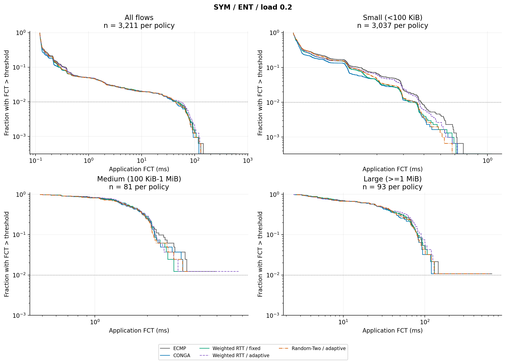

[SVG version](sym/load_2/fct_tail.svg)

### SYM / load 0.3: Per-load FCT distribution

Within each size class, the vertical value is the fraction of verified completed flows with application FCT at or below the horizontal value. The horizontal scale is logarithmic; a curve further left reaches a given completion fraction sooner. Step shapes, especially for a small large-flow population, are expected. Each panel gives its number of flows per policy; no sizes are pooled across classes.

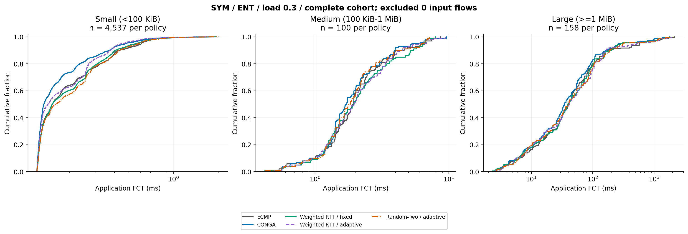

[SVG version](sym/load_3/fct_cdf.svg)

### SYM / load 0.3: Per-load directed uplink utilization

Each cell is bytes transmitted on that leaf-to-spine link during 0–5 s, divided by that individual link's capacity over five seconds. Cells are not shares of a single total and do not sum to 100%. The reduced Leaf 0–Spine 0 link uses 5 Gb/s for asymmetric runs. Other links use 10 Gb/s. The same color scale is used across all exported heatmaps. Traffic during drain is excluded; these averages do not reveal instantaneous queueing or prove packet reordering.

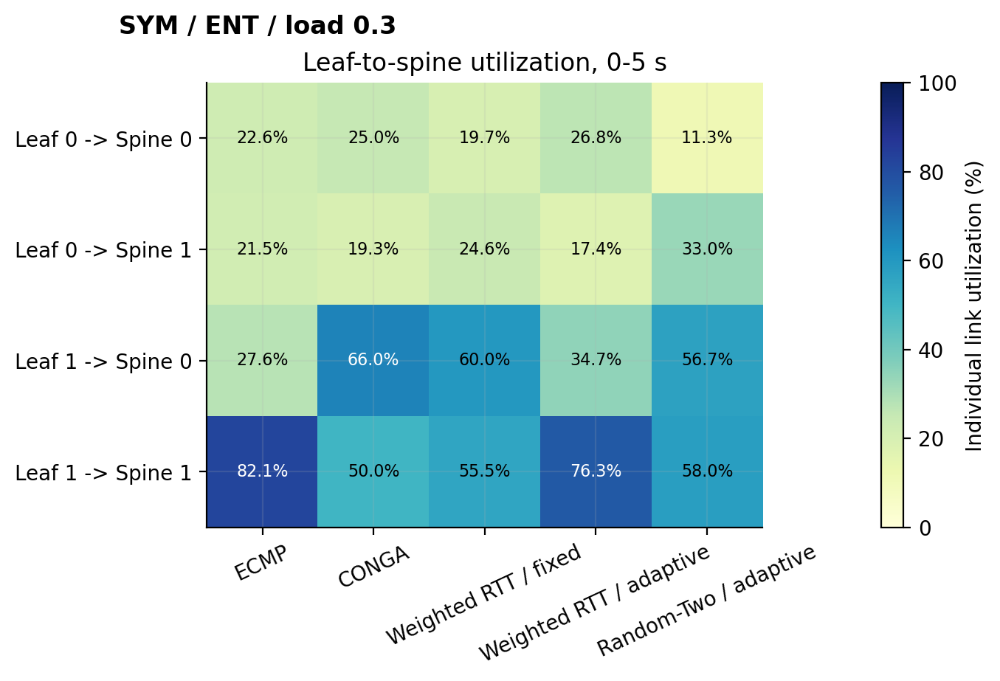

[SVG version](sym/load_3/uplink_utilization.svg)

### SYM / load 0.3: Per-load FCT tail

The complementary CDF shows the fraction with application FCT strictly greater than the horizontal value, using logarithmic axes. At a fixed threshold, lower means fewer flows exceed it. The dotted 0.01 reference marks a one-percent tail. Ties are counted together and the zero-probability endpoint is omitted; a curve ending before another is not an incomplete transfer. Sample counts are shown, and the ordinary CDF remains available alongside this view.

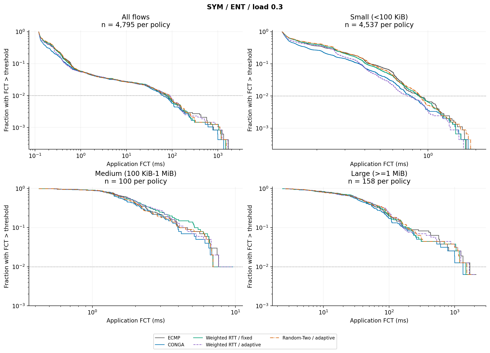

[SVG version](sym/load_3/fct_tail.svg)

### SYM / load 0.4: Per-load FCT distribution

Within each size class, the vertical value is the fraction of verified completed flows with application FCT at or below the horizontal value. The horizontal scale is logarithmic; a curve further left reaches a given completion fraction sooner. Step shapes, especially for a small large-flow population, are expected. Each panel gives its number of flows per policy; no sizes are pooled across classes.

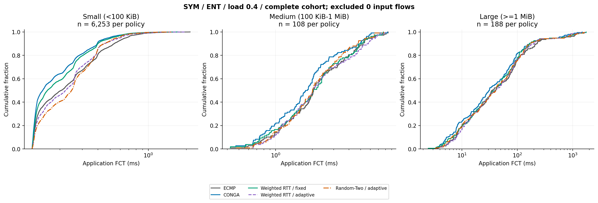

[SVG version](sym/load_4/fct_cdf.svg)

### SYM / load 0.4: Per-load directed uplink utilization

Each cell is bytes transmitted on that leaf-to-spine link during 0–5 s, divided by that individual link's capacity over five seconds. Cells are not shares of a single total and do not sum to 100%. The reduced Leaf 0–Spine 0 link uses 5 Gb/s for asymmetric runs. Other links use 10 Gb/s. The same color scale is used across all exported heatmaps. Traffic during drain is excluded; these averages do not reveal instantaneous queueing or prove packet reordering.

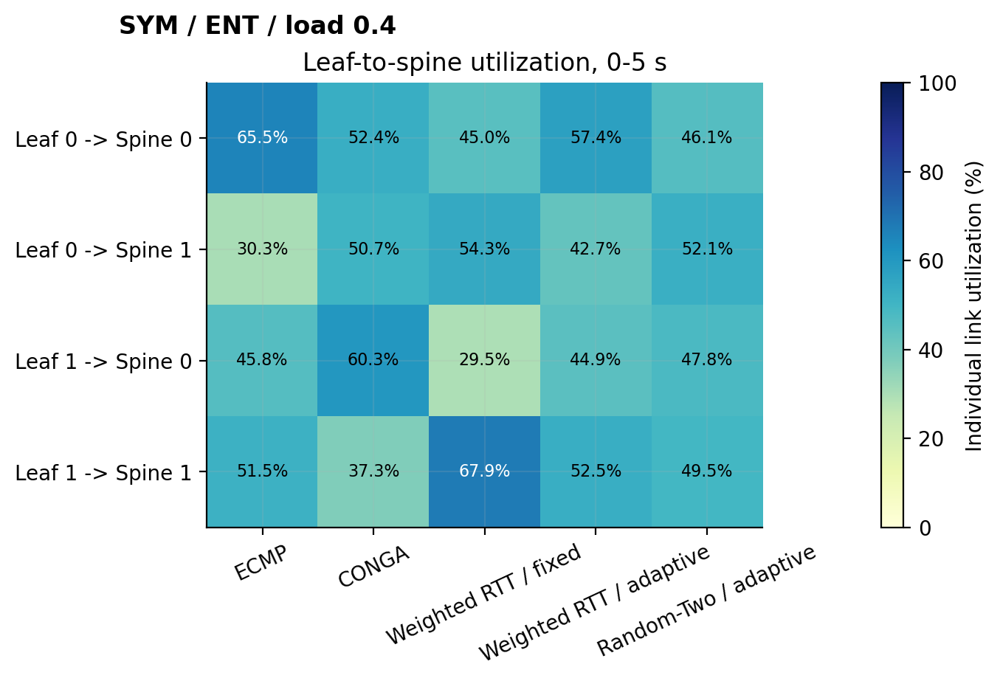

[SVG version](sym/load_4/uplink_utilization.svg)

### SYM / load 0.4: Per-load FCT tail

The complementary CDF shows the fraction with application FCT strictly greater than the horizontal value, using logarithmic axes. At a fixed threshold, lower means fewer flows exceed it. The dotted 0.01 reference marks a one-percent tail. Ties are counted together and the zero-probability endpoint is omitted; a curve ending before another is not an incomplete transfer. Sample counts are shown, and the ordinary CDF remains available alongside this view.

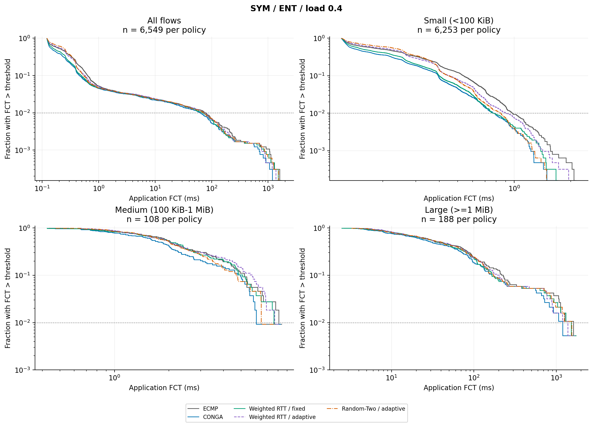

[SVG version](sym/load_4/fct_tail.svg)

### SYM / load 0.5: Per-load FCT distribution

Within each size class, the vertical value is the fraction of verified completed flows with application FCT at or below the horizontal value. The horizontal scale is logarithmic; a curve further left reaches a given completion fraction sooner. Step shapes, especially for a small large-flow population, are expected. Each panel gives its number of flows per policy; no sizes are pooled across classes.

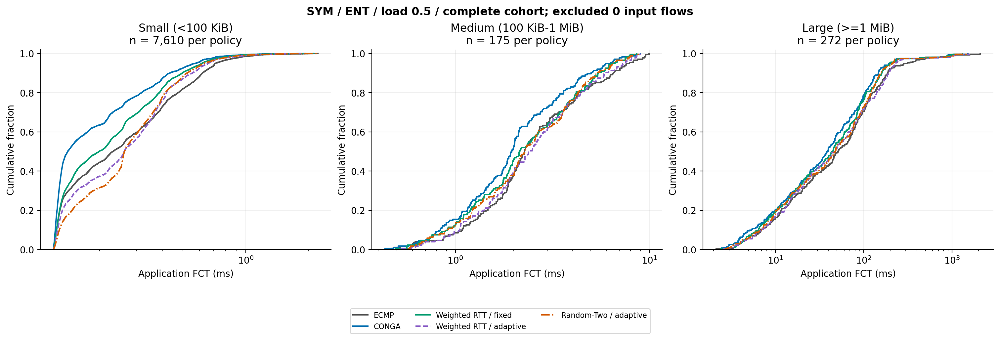

[SVG version](sym/load_5/fct_cdf.svg)

### SYM / load 0.5: Per-load directed uplink utilization

Each cell is bytes transmitted on that leaf-to-spine link during 0–5 s, divided by that individual link's capacity over five seconds. Cells are not shares of a single total and do not sum to 100%. The reduced Leaf 0–Spine 0 link uses 5 Gb/s for asymmetric runs. Other links use 10 Gb/s. The same color scale is used across all exported heatmaps. Traffic during drain is excluded; these averages do not reveal instantaneous queueing or prove packet reordering.

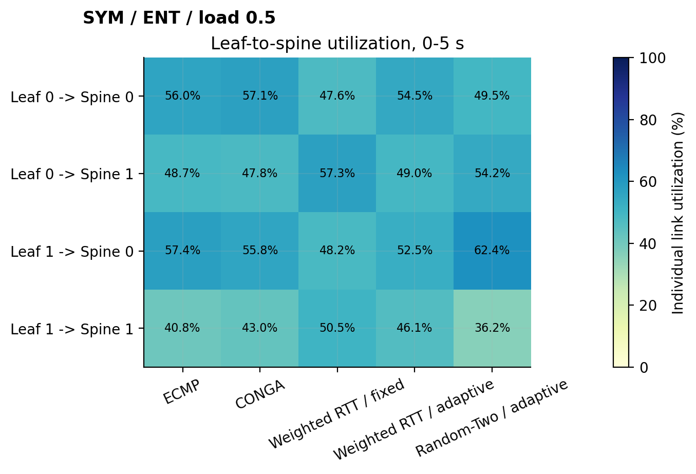

[SVG version](sym/load_5/uplink_utilization.svg)

### SYM / load 0.5: Per-load FCT tail

The complementary CDF shows the fraction with application FCT strictly greater than the horizontal value, using logarithmic axes. At a fixed threshold, lower means fewer flows exceed it. The dotted 0.01 reference marks a one-percent tail. Ties are counted together and the zero-probability endpoint is omitted; a curve ending before another is not an incomplete transfer. Sample counts are shown, and the ordinary CDF remains available alongside this view.

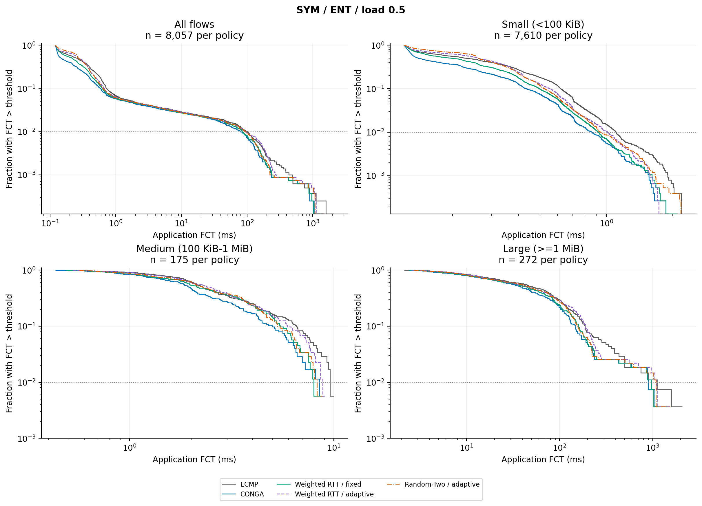

[SVG version](sym/load_5/fct_tail.svg)

### SYM / load 0.6: Per-load FCT distribution

Within each size class, the vertical value is the fraction of verified completed flows with application FCT at or below the horizontal value. The horizontal scale is logarithmic; a curve further left reaches a given completion fraction sooner. Step shapes, especially for a small large-flow population, are expected. Each panel gives its number of flows per policy; no sizes are pooled across classes.

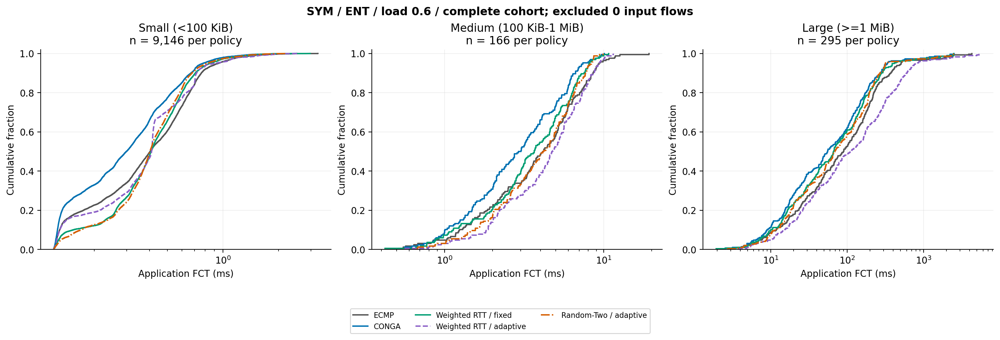

[SVG version](sym/load_6/fct_cdf.svg)

### SYM / load 0.6: Per-load directed uplink utilization

Each cell is bytes transmitted on that leaf-to-spine link during 0–5 s, divided by that individual link's capacity over five seconds. Cells are not shares of a single total and do not sum to 100%. The reduced Leaf 0–Spine 0 link uses 5 Gb/s for asymmetric runs. Other links use 10 Gb/s. The same color scale is used across all exported heatmaps. Traffic during drain is excluded; these averages do not reveal instantaneous queueing or prove packet reordering.

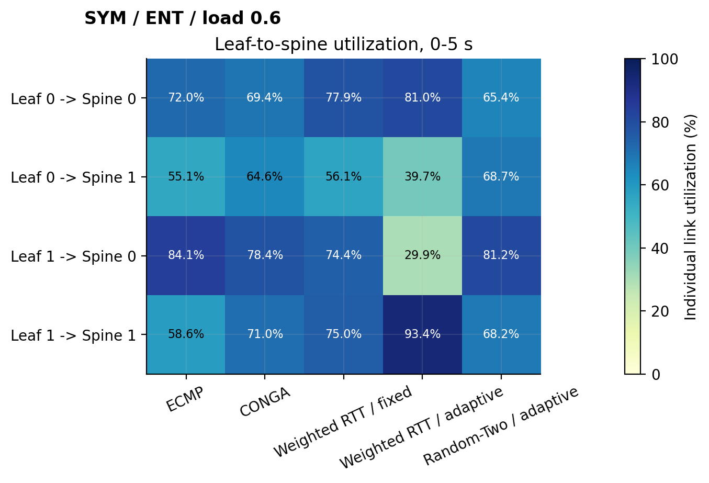

[SVG version](sym/load_6/uplink_utilization.svg)

### SYM / load 0.6: Per-load FCT tail

The complementary CDF shows the fraction with application FCT strictly greater than the horizontal value, using logarithmic axes. At a fixed threshold, lower means fewer flows exceed it. The dotted 0.01 reference marks a one-percent tail. Ties are counted together and the zero-probability endpoint is omitted; a curve ending before another is not an incomplete transfer. Sample counts are shown, and the ordinary CDF remains available alongside this view.

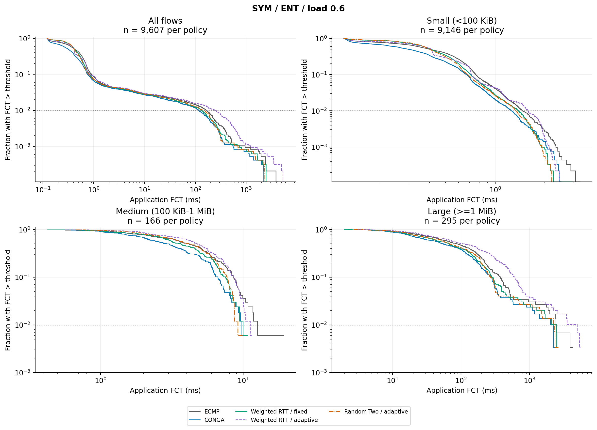

[SVG version](sym/load_6/fct_tail.svg)

### SYM / load 0.7: Per-load FCT distribution

Within each size class, the vertical value is the fraction of verified completed flows with application FCT at or below the horizontal value. The horizontal scale is logarithmic; a curve further left reaches a given completion fraction sooner. Step shapes, especially for a small large-flow population, are expected. Each panel gives its number of flows per policy; no sizes are pooled across classes.

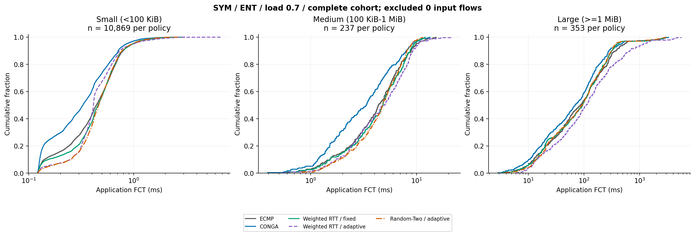

[SVG version](sym/load_7/fct_cdf.svg)

### SYM / load 0.7: Per-load directed uplink utilization

Each cell is bytes transmitted on that leaf-to-spine link during 0–5 s, divided by that individual link's capacity over five seconds. Cells are not shares of a single total and do not sum to 100%. The reduced Leaf 0–Spine 0 link uses 5 Gb/s for asymmetric runs. Other links use 10 Gb/s. The same color scale is used across all exported heatmaps. Traffic during drain is excluded; these averages do not reveal instantaneous queueing or prove packet reordering.

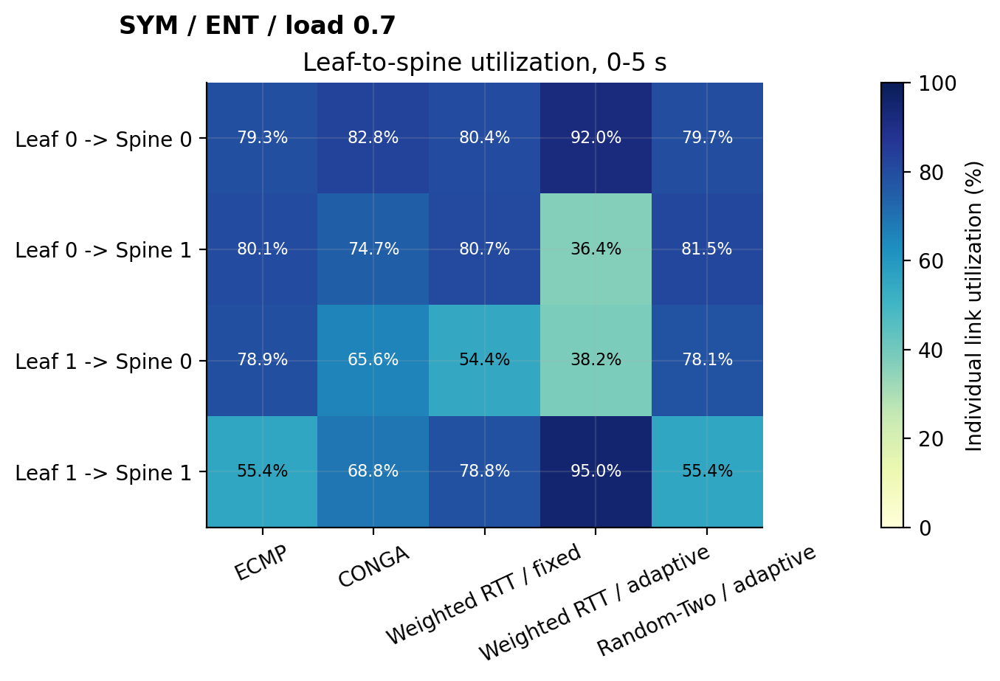

[SVG version](sym/load_7/uplink_utilization.svg)

### SYM / load 0.7: Per-load FCT tail

The complementary CDF shows the fraction with application FCT strictly greater than the horizontal value, using logarithmic axes. At a fixed threshold, lower means fewer flows exceed it. The dotted 0.01 reference marks a one-percent tail. Ties are counted together and the zero-probability endpoint is omitted; a curve ending before another is not an incomplete transfer. Sample counts are shown, and the ordinary CDF remains available alongside this view.

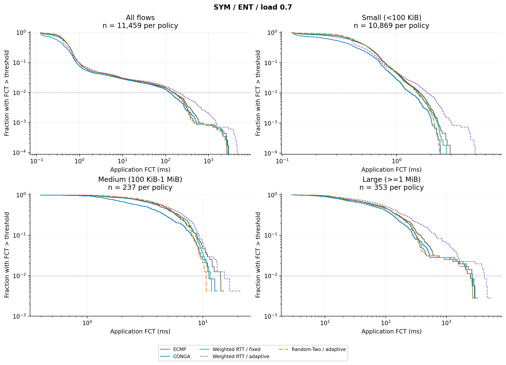

[SVG version](sym/load_7/fct_tail.svg)

### SYM / load 0.8: Per-load FCT distribution

Within each size class, the vertical value is the fraction of verified completed flows with application FCT at or below the horizontal value. The horizontal scale is logarithmic; a curve further left reaches a given completion fraction sooner. Step shapes, especially for a small large-flow population, are expected. Each panel gives its number of flows per policy; no sizes are pooled across classes.

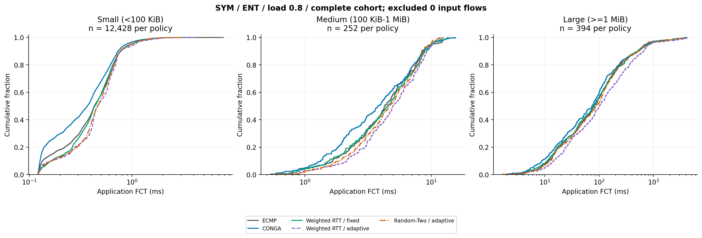

[SVG version](sym/load_8/fct_cdf.svg)

### SYM / load 0.8: Per-load directed uplink utilization

Each cell is bytes transmitted on that leaf-to-spine link during 0–5 s, divided by that individual link's capacity over five seconds. Cells are not shares of a single total and do not sum to 100%. The reduced Leaf 0–Spine 0 link uses 5 Gb/s for asymmetric runs. Other links use 10 Gb/s. The same color scale is used across all exported heatmaps. Traffic during drain is excluded; these averages do not reveal instantaneous queueing or prove packet reordering.

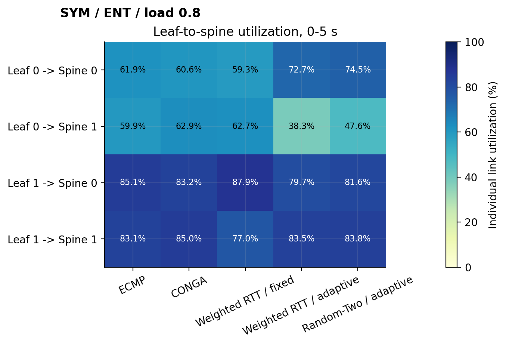

[SVG version](sym/load_8/uplink_utilization.svg)

### SYM / load 0.8: Per-load FCT tail

The complementary CDF shows the fraction with application FCT strictly greater than the horizontal value, using logarithmic axes. At a fixed threshold, lower means fewer flows exceed it. The dotted 0.01 reference marks a one-percent tail. Ties are counted together and the zero-probability endpoint is omitted; a curve ending before another is not an incomplete transfer. Sample counts are shown, and the ordinary CDF remains available alongside this view.

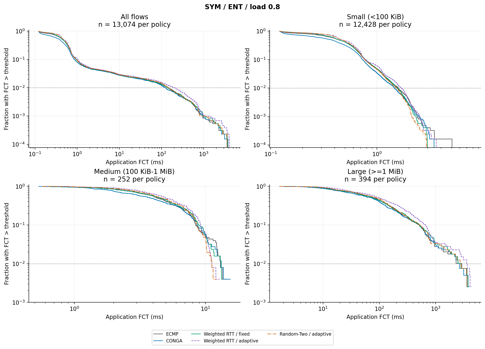

[SVG version](sym/load_8/fct_tail.svg)

### SYM / load 0.9: Per-load FCT distribution

Within each size class, the vertical value is the fraction of verified completed flows with application FCT at or below the horizontal value. The horizontal scale is logarithmic; a curve further left reaches a given completion fraction sooner. Step shapes, especially for a small large-flow population, are expected. Each panel gives its number of flows per policy; no sizes are pooled across classes.

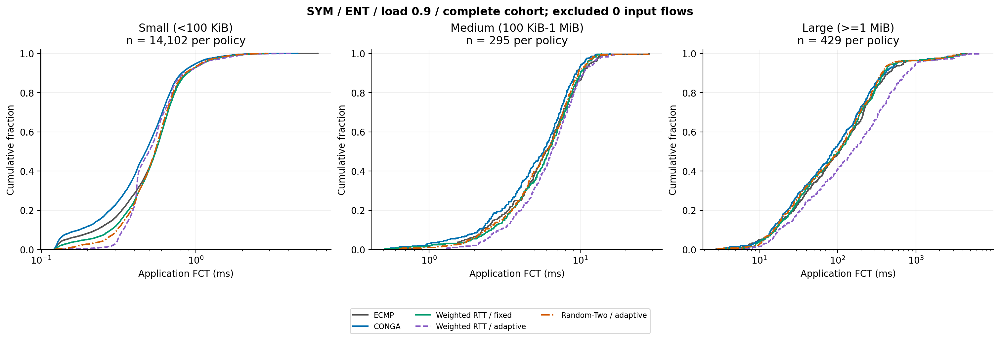

[SVG version](sym/load_9/fct_cdf.svg)

### SYM / load 0.9: Per-load directed uplink utilization

Each cell is bytes transmitted on that leaf-to-spine link during 0–5 s, divided by that individual link's capacity over five seconds. Cells are not shares of a single total and do not sum to 100%. The reduced Leaf 0–Spine 0 link uses 5 Gb/s for asymmetric runs. Other links use 10 Gb/s. The same color scale is used across all exported heatmaps. Traffic during drain is excluded; these averages do not reveal instantaneous queueing or prove packet reordering.

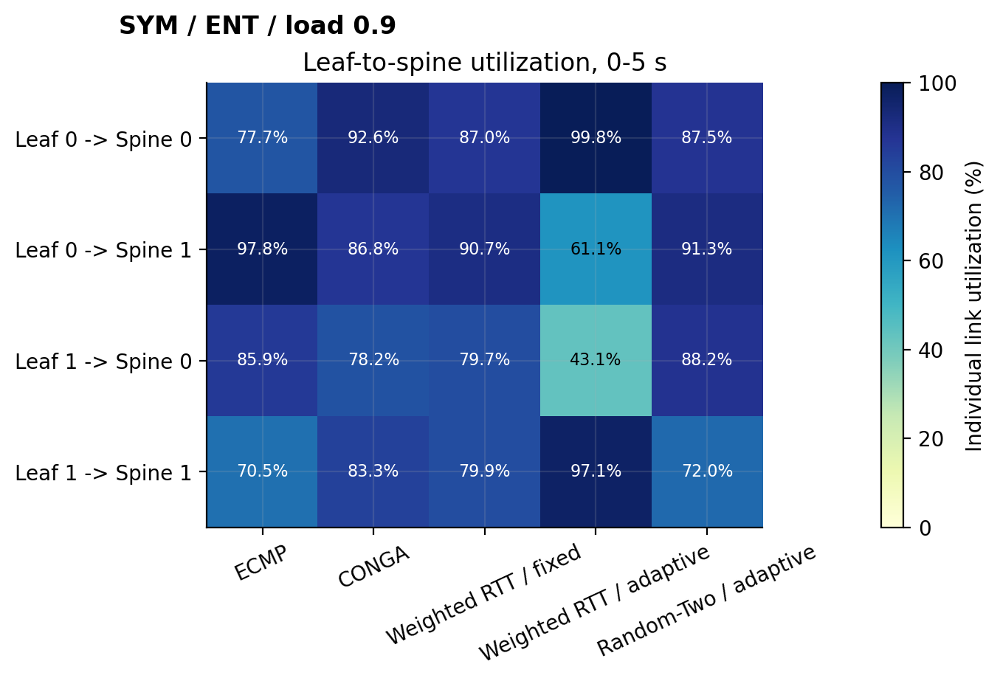

[SVG version](sym/load_9/uplink_utilization.svg)

### SYM / load 0.9: Per-load FCT tail

The complementary CDF shows the fraction with application FCT strictly greater than the horizontal value, using logarithmic axes. At a fixed threshold, lower means fewer flows exceed it. The dotted 0.01 reference marks a one-percent tail. Ties are counted together and the zero-probability endpoint is omitted; a curve ending before another is not an incomplete transfer. Sample counts are shown, and the ordinary CDF remains available alongside this view.

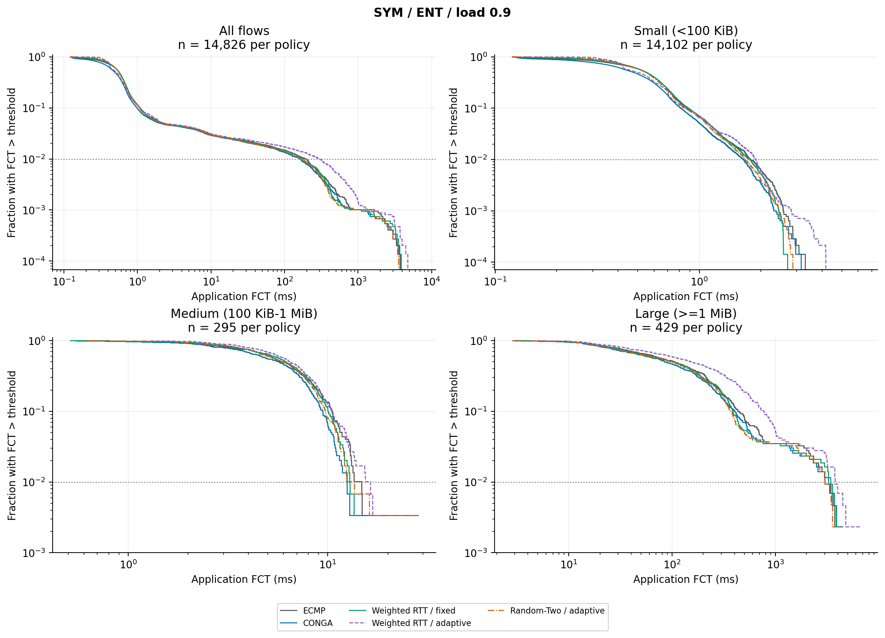

[SVG version](sym/load_9/fct_tail.svg)

### ASYM: Application delivery and validation

All requested flows are counted. The panels show exact-size deliveries, missing application bytes, and flows with any validation finding. Unknown receive counts are unavailable rather than zero. The figure gate also requires every independent sink audit and flow match to pass. The last two axes use a linear region around zero, followed by logarithmic scaling.

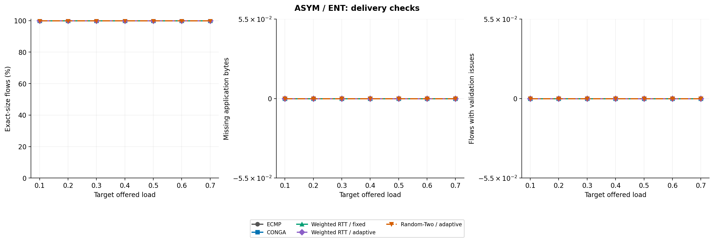

[SVG version](asym/payload_delivery_vs_load.svg)

### ASYM: Packet loss and queue drops

The panels show forward FlowMonitor loss, root queue-disc drops across all interfaces and directions, root drops per delivered MiB, and device-queue drops. These counters have different scopes and may refer to overlapping packet events; do not add them. Root FqCoDel drops may represent queue management, not merely a physically full device queue. Event-stage and reason tables are exported under each topology's summary folder. Coincident zero-valued curves can cover one another.

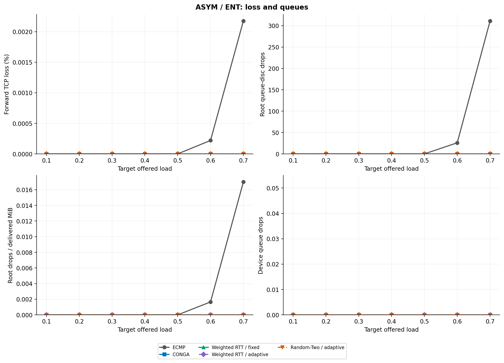

[SVG version](asym/packet_loss_and_queue_drops.svg)

### ASYM: Overall mean application FCT

The left panel shows the arithmetic mean over all input flows, in milliseconds on a logarithmic axis. The right divides each mean by CONGA's mean for the same flows; lower is better and one equals CONGA. Small and large transfers each contribute one FCT value. The overall mean is not an average of the size-class means. Compare within a topology; asymmetric experiments have less capacity.

[SVG version](asym/overall_mean_fct_vs_load.svg)

### ASYM: Mean and p99 FCT by flow size

Columns split flows at 100 KiB and 1 MiB; rows show the arithmetic mean and sample p99. The vertical axes are logarithmic and may have different scales. Inspect large-flow behavior separately from small-flow latency. The fct_summary.csv file records the sample count for each class; a p99 from a small class depends on very few flows.

[SVG version](asym/fct_vs_load.svg)

### ASYM: Size-class mean FCT relative to ECMP

Each point is mean(policy FCT) / mean(ECMP FCT) in the same size class and matched cohort. Below one means a lower mean FCT than ECMP; above one means a higher mean. This is a ratio of means, not the mean of individual flow ratios. The denominator is ECMP, unlike the overall normalized panels.

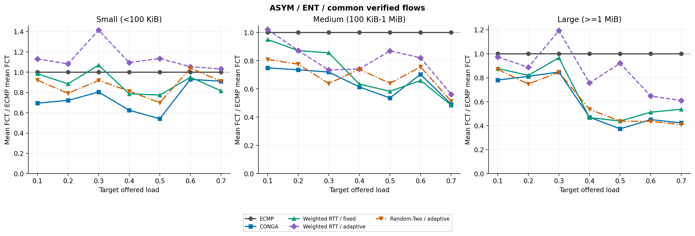

[SVG version](asym/normalized_mean_fct_vs_load.svg)

### ASYM: Overall p99 application FCT

The left panel is the sample 99th percentile over all flow sizes. The right is the ratio of that percentile to CONGA's percentile for the same input-flow cohort. A larger mean improvement can coexist with a worse p99. These are quantiles of one simulation's flow population, not confidence intervals across repeated runs.

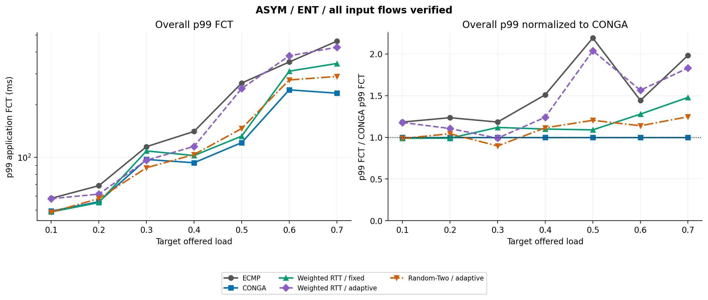

[SVG version](asym/overall_p99_fct_vs_load.svg)

### ASYM: Size-class p99 FCT relative to ECMP

Each point divides the policy's sample p99 by ECMP's sample p99 over the same size class and flow cohort. Below one means a lower tail percentile. A p99 ratio is not the 99th percentile of per-flow speedups, and it does not describe run-to-run uncertainty.

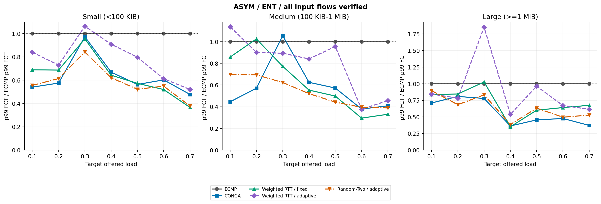

[SVG version](asym/normalized_p99_fct_vs_load.svg)

### ASYM: Forward TCP packet loss

FlowMonitor lost packets divided by transmitted packets, multiplied by 100, for forward TCP connections matched uniquely to the input flows. This includes connection-control traffic on those connections; it is not a fraction of missing payload bytes or a count of all retransmissions. Zero means no recorded forward losses under this counter.

[SVG version](asym/forward_packet_loss_vs_load.svg)

### ASYM / load 0.1: Per-load FCT distribution

Within each size class, the vertical value is the fraction of verified completed flows with application FCT at or below the horizontal value. The horizontal scale is logarithmic; a curve further left reaches a given completion fraction sooner. Step shapes, especially for a small large-flow population, are expected. Each panel gives its number of flows per policy; no sizes are pooled across classes.

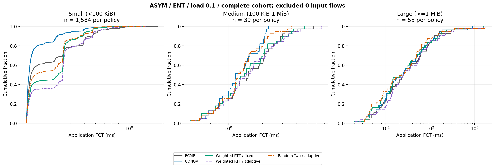

[SVG version](asym/load_1/fct_cdf.svg)

### ASYM / load 0.1: Per-load directed uplink utilization

Each cell is bytes transmitted on that leaf-to-spine link during 0–5 s, divided by that individual link's capacity over five seconds. Cells are not shares of a single total and do not sum to 100%. The reduced Leaf 0–Spine 0 link uses 5 Gb/s for asymmetric runs. Other links use 10 Gb/s. The same color scale is used across all exported heatmaps. Traffic during drain is excluded; these averages do not reveal instantaneous queueing or prove packet reordering.

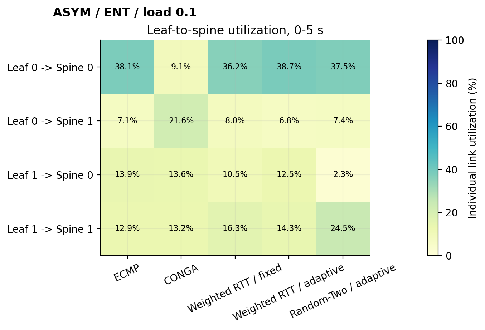

[SVG version](asym/load_1/uplink_utilization.svg)

### ASYM / load 0.1: Per-load FCT tail

The complementary CDF shows the fraction with application FCT strictly greater than the horizontal value, using logarithmic axes. At a fixed threshold, lower means fewer flows exceed it. The dotted 0.01 reference marks a one-percent tail. Ties are counted together and the zero-probability endpoint is omitted; a curve ending before another is not an incomplete transfer. Sample counts are shown, and the ordinary CDF remains available alongside this view.

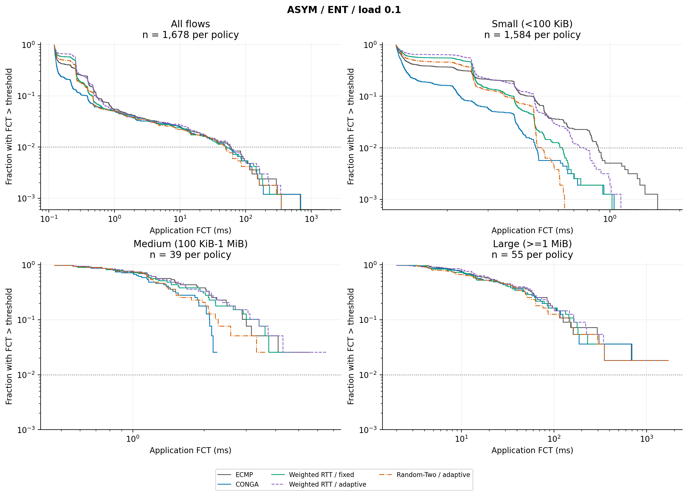

[SVG version](asym/load_1/fct_tail.svg)

### ASYM / load 0.2: Per-load FCT distribution

Within each size class, the vertical value is the fraction of verified completed flows with application FCT at or below the horizontal value. The horizontal scale is logarithmic; a curve further left reaches a given completion fraction sooner. Step shapes, especially for a small large-flow population, are expected. Each panel gives its number of flows per policy; no sizes are pooled across classes.

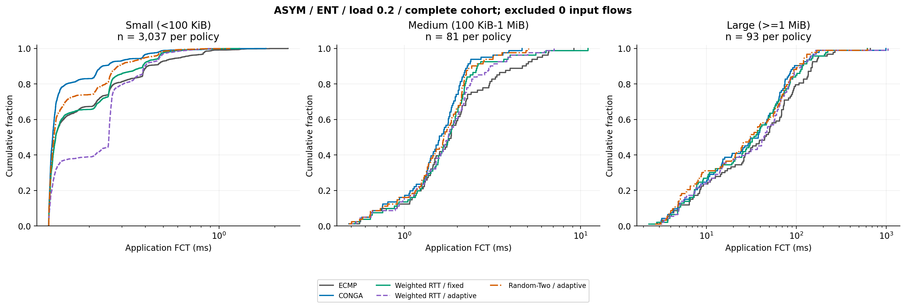

[SVG version](asym/load_2/fct_cdf.svg)

### ASYM / load 0.2: Per-load directed uplink utilization

Each cell is bytes transmitted on that leaf-to-spine link during 0–5 s, divided by that individual link's capacity over five seconds. Cells are not shares of a single total and do not sum to 100%. The reduced Leaf 0–Spine 0 link uses 5 Gb/s for asymmetric runs. Other links use 10 Gb/s. The same color scale is used across all exported heatmaps. Traffic during drain is excluded; these averages do not reveal instantaneous queueing or prove packet reordering.

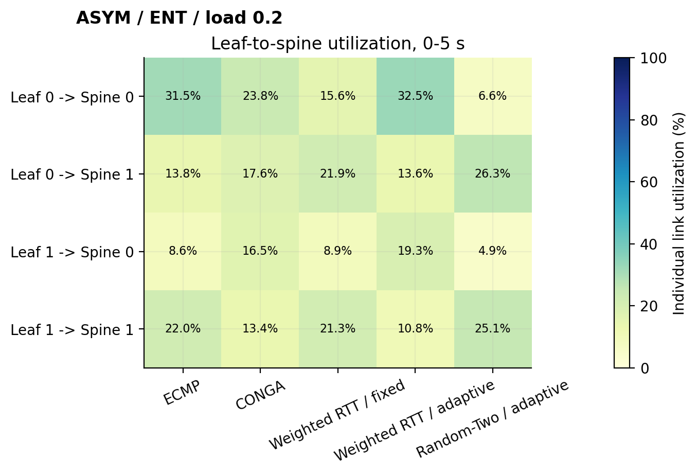

[SVG version](asym/load_2/uplink_utilization.svg)

### ASYM / load 0.2: Per-load FCT tail

The complementary CDF shows the fraction with application FCT strictly greater than the horizontal value, using logarithmic axes. At a fixed threshold, lower means fewer flows exceed it. The dotted 0.01 reference marks a one-percent tail. Ties are counted together and the zero-probability endpoint is omitted; a curve ending before another is not an incomplete transfer. Sample counts are shown, and the ordinary CDF remains available alongside this view.

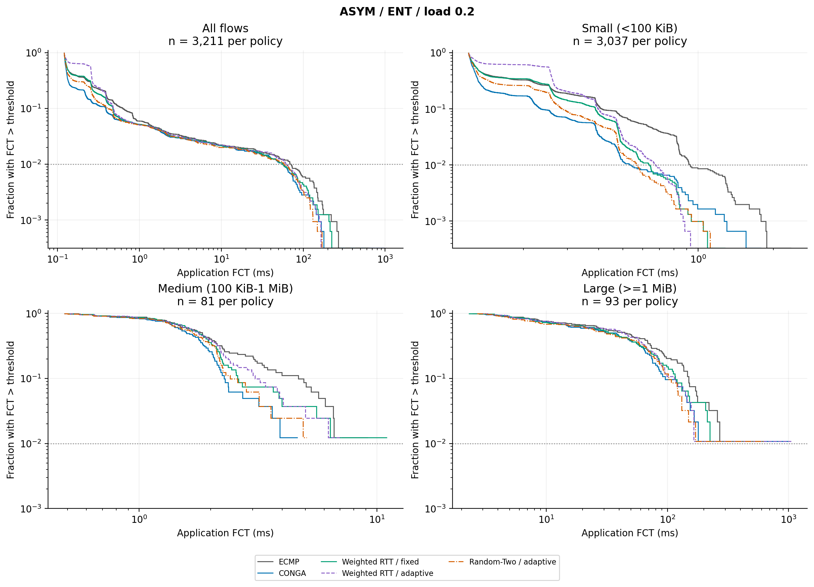

[SVG version](asym/load_2/fct_tail.svg)

### ASYM / load 0.3: Per-load FCT distribution

Within each size class, the vertical value is the fraction of verified completed flows with application FCT at or below the horizontal value. The horizontal scale is logarithmic; a curve further left reaches a given completion fraction sooner. Step shapes, especially for a small large-flow population, are expected. Each panel gives its number of flows per policy; no sizes are pooled across classes.

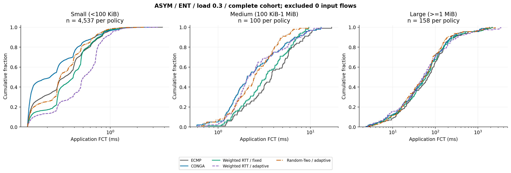

[SVG version](asym/load_3/fct_cdf.svg)

### ASYM / load 0.3: Per-load directed uplink utilization

Each cell is bytes transmitted on that leaf-to-spine link during 0–5 s, divided by that individual link's capacity over five seconds. Cells are not shares of a single total and do not sum to 100%. The reduced Leaf 0–Spine 0 link uses 5 Gb/s for asymmetric runs. Other links use 10 Gb/s. The same color scale is used across all exported heatmaps. Traffic during drain is excluded; these averages do not reveal instantaneous queueing or prove packet reordering.

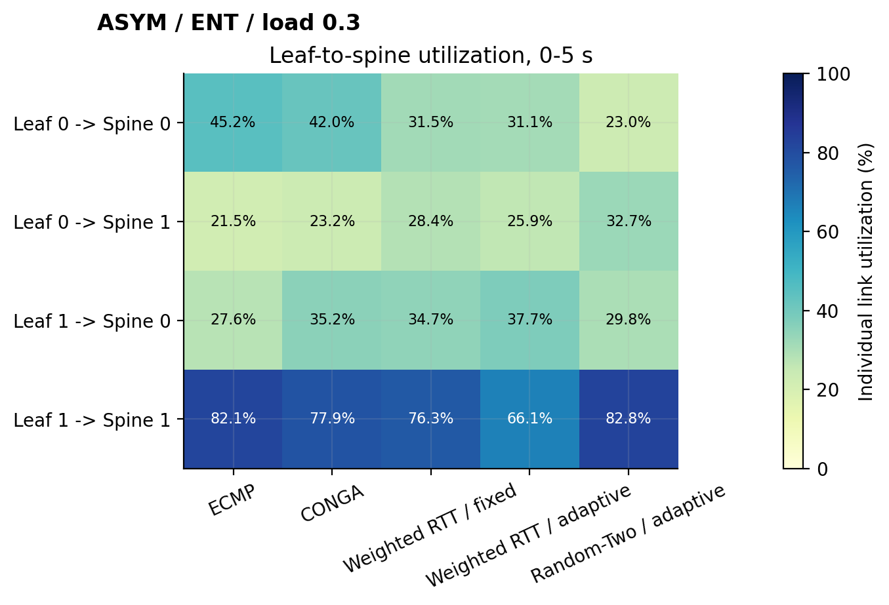

[SVG version](asym/load_3/uplink_utilization.svg)

### ASYM / load 0.3: Per-load FCT tail

The complementary CDF shows the fraction with application FCT strictly greater than the horizontal value, using logarithmic axes. At a fixed threshold, lower means fewer flows exceed it. The dotted 0.01 reference marks a one-percent tail. Ties are counted together and the zero-probability endpoint is omitted; a curve ending before another is not an incomplete transfer. Sample counts are shown, and the ordinary CDF remains available alongside this view.

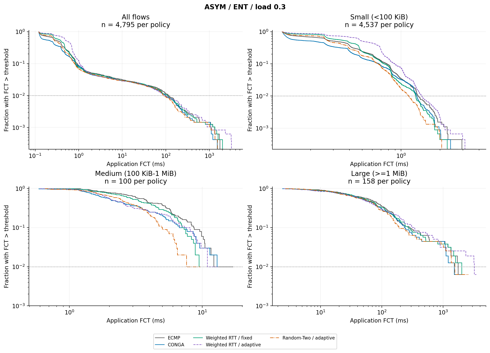

[SVG version](asym/load_3/fct_tail.svg)

### ASYM / load 0.4: Per-load FCT distribution

Within each size class, the vertical value is the fraction of verified completed flows with application FCT at or below the horizontal value. The horizontal scale is logarithmic; a curve further left reaches a given completion fraction sooner. Step shapes, especially for a small large-flow population, are expected. Each panel gives its number of flows per policy; no sizes are pooled across classes.

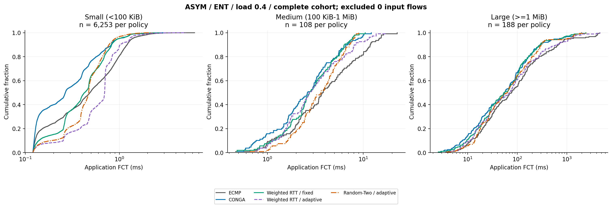

[SVG version](asym/load_4/fct_cdf.svg)

### ASYM / load 0.4: Per-load directed uplink utilization

Each cell is bytes transmitted on that leaf-to-spine link during 0–5 s, divided by that individual link's capacity over five seconds. Cells are not shares of a single total and do not sum to 100%. The reduced Leaf 0–Spine 0 link uses 5 Gb/s for asymmetric runs. Other links use 10 Gb/s. The same color scale is used across all exported heatmaps. Traffic during drain is excluded; these averages do not reveal instantaneous queueing or prove packet reordering.

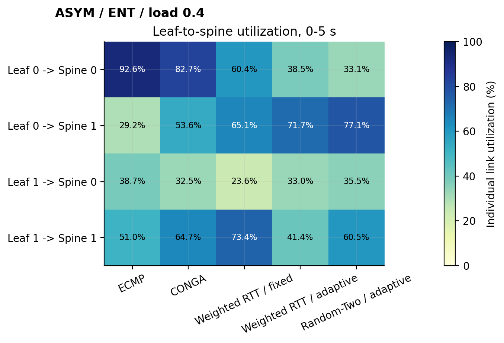

[SVG version](asym/load_4/uplink_utilization.svg)

### ASYM / load 0.4: Per-load FCT tail

The complementary CDF shows the fraction with application FCT strictly greater than the horizontal value, using logarithmic axes. At a fixed threshold, lower means fewer flows exceed it. The dotted 0.01 reference marks a one-percent tail. Ties are counted together and the zero-probability endpoint is omitted; a curve ending before another is not an incomplete transfer. Sample counts are shown, and the ordinary CDF remains available alongside this view.

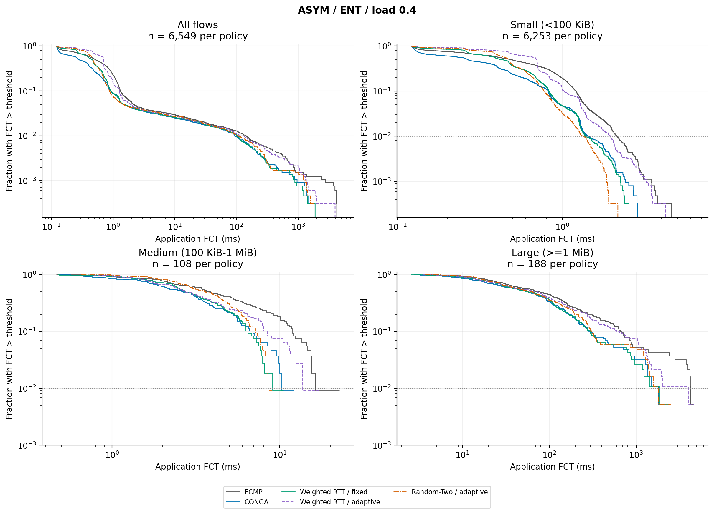

[SVG version](asym/load_4/fct_tail.svg)

### ASYM / load 0.5: Per-load FCT distribution

Within each size class, the vertical value is the fraction of verified completed flows with application FCT at or below the horizontal value. The horizontal scale is logarithmic; a curve further left reaches a given completion fraction sooner. Step shapes, especially for a small large-flow population, are expected. Each panel gives its number of flows per policy; no sizes are pooled across classes.

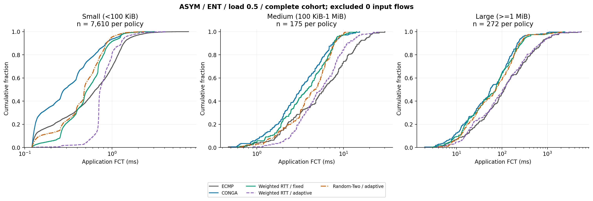

[SVG version](asym/load_5/fct_cdf.svg)

### ASYM / load 0.5: Per-load directed uplink utilization

Each cell is bytes transmitted on that leaf-to-spine link during 0–5 s, divided by that individual link's capacity over five seconds. Cells are not shares of a single total and do not sum to 100%. The reduced Leaf 0–Spine 0 link uses 5 Gb/s for asymmetric runs. Other links use 10 Gb/s. The same color scale is used across all exported heatmaps. Traffic during drain is excluded; these averages do not reveal instantaneous queueing or prove packet reordering.

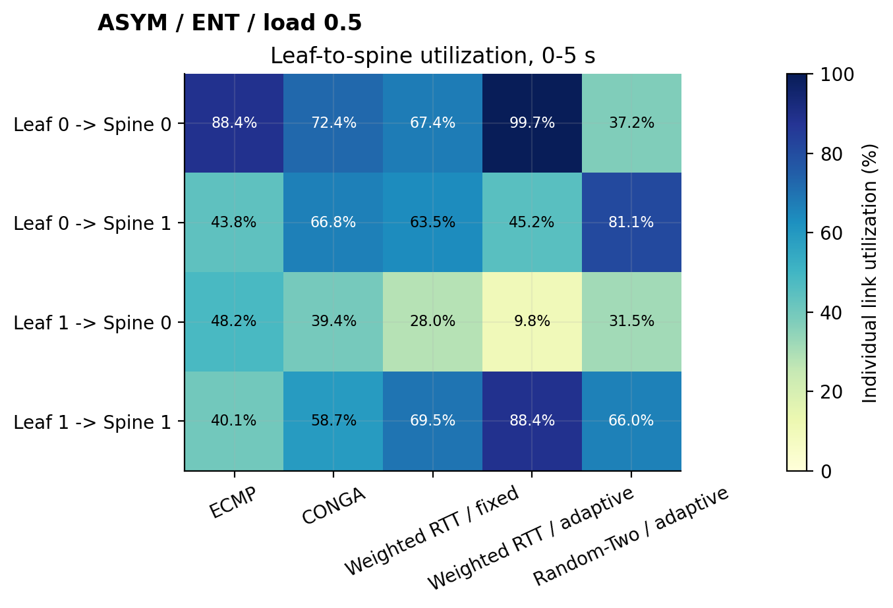

[SVG version](asym/load_5/uplink_utilization.svg)

### ASYM / load 0.5: Per-load FCT tail

The complementary CDF shows the fraction with application FCT strictly greater than the horizontal value, using logarithmic axes. At a fixed threshold, lower means fewer flows exceed it. The dotted 0.01 reference marks a one-percent tail. Ties are counted together and the zero-probability endpoint is omitted; a curve ending before another is not an incomplete transfer. Sample counts are shown, and the ordinary CDF remains available alongside this view.

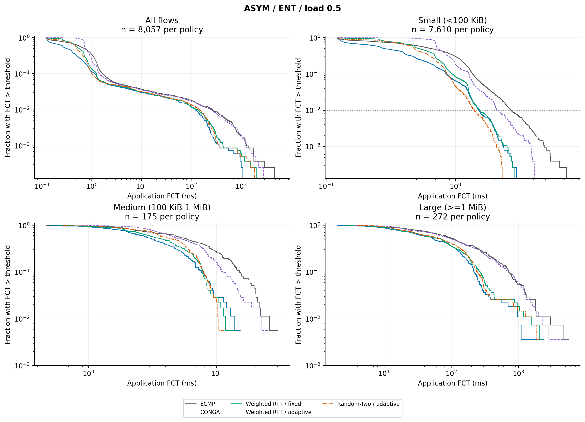

[SVG version](asym/load_5/fct_tail.svg)

### ASYM / load 0.6: Per-load FCT distribution

Within each size class, the vertical value is the fraction of verified completed flows with application FCT at or below the horizontal value. The horizontal scale is logarithmic; a curve further left reaches a given completion fraction sooner. Step shapes, especially for a small large-flow population, are expected. Each panel gives its number of flows per policy; no sizes are pooled across classes.

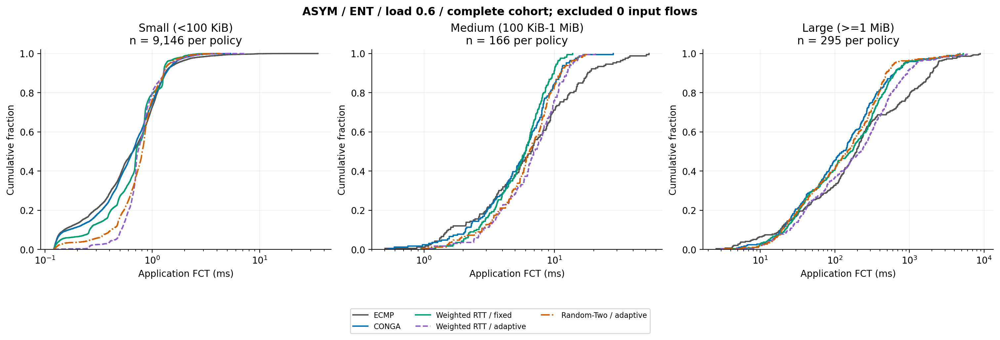

[SVG version](asym/load_6/fct_cdf.svg)

### ASYM / load 0.6: Per-load directed uplink utilization

Each cell is bytes transmitted on that leaf-to-spine link during 0–5 s, divided by that individual link's capacity over five seconds. Cells are not shares of a single total and do not sum to 100%. The reduced Leaf 0–Spine 0 link uses 5 Gb/s for asymmetric runs. Other links use 10 Gb/s. The same color scale is used across all exported heatmaps. Traffic during drain is excluded; these averages do not reveal instantaneous queueing or prove packet reordering.

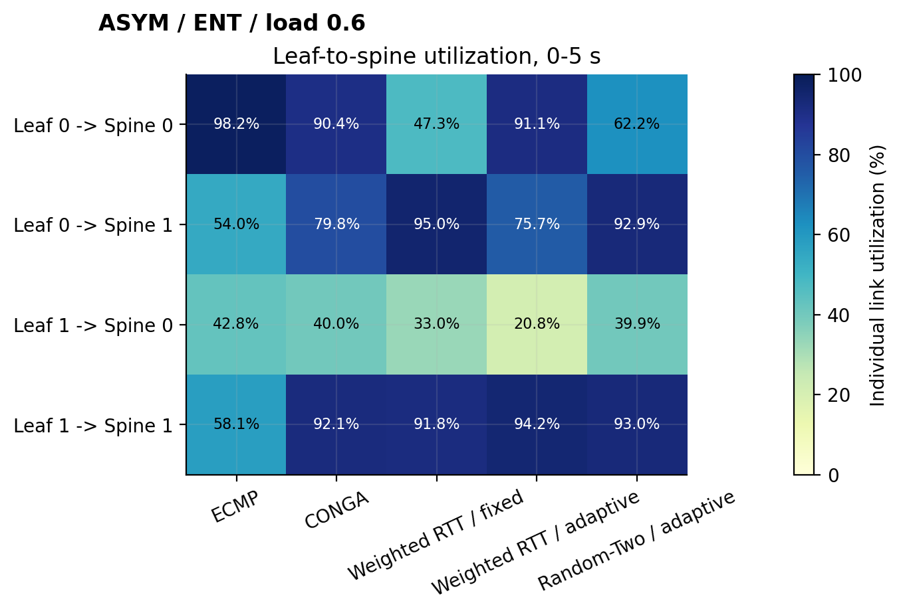

[SVG version](asym/load_6/uplink_utilization.svg)

### ASYM / load 0.6: Per-load FCT tail

The complementary CDF shows the fraction with application FCT strictly greater than the horizontal value, using logarithmic axes. At a fixed threshold, lower means fewer flows exceed it. The dotted 0.01 reference marks a one-percent tail. Ties are counted together and the zero-probability endpoint is omitted; a curve ending before another is not an incomplete transfer. Sample counts are shown, and the ordinary CDF remains available alongside this view.

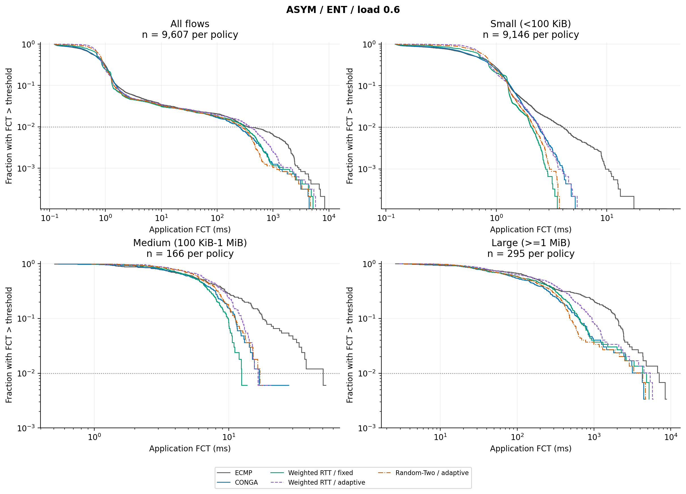

[SVG version](asym/load_6/fct_tail.svg)

### ASYM / load 0.7: Per-load FCT distribution

Within each size class, the vertical value is the fraction of verified completed flows with application FCT at or below the horizontal value. The horizontal scale is logarithmic; a curve further left reaches a given completion fraction sooner. Step shapes, especially for a small large-flow population, are expected. Each panel gives its number of flows per policy; no sizes are pooled across classes.

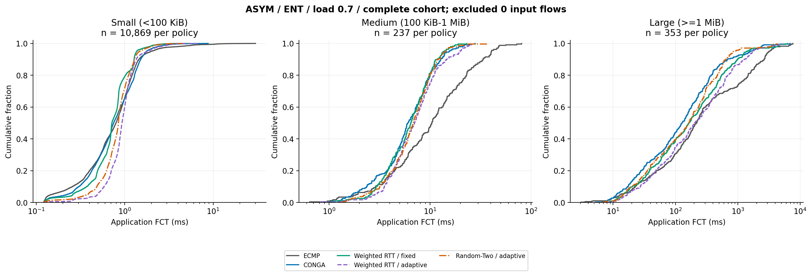

[SVG version](asym/load_7/fct_cdf.svg)

### ASYM / load 0.7: Per-load directed uplink utilization

Each cell is bytes transmitted on that leaf-to-spine link during 0–5 s, divided by that individual link's capacity over five seconds. Cells are not shares of a single total and do not sum to 100%. The reduced Leaf 0–Spine 0 link uses 5 Gb/s for asymmetric runs. Other links use 10 Gb/s. The same color scale is used across all exported heatmaps. Traffic during drain is excluded; these averages do not reveal instantaneous queueing or prove packet reordering.

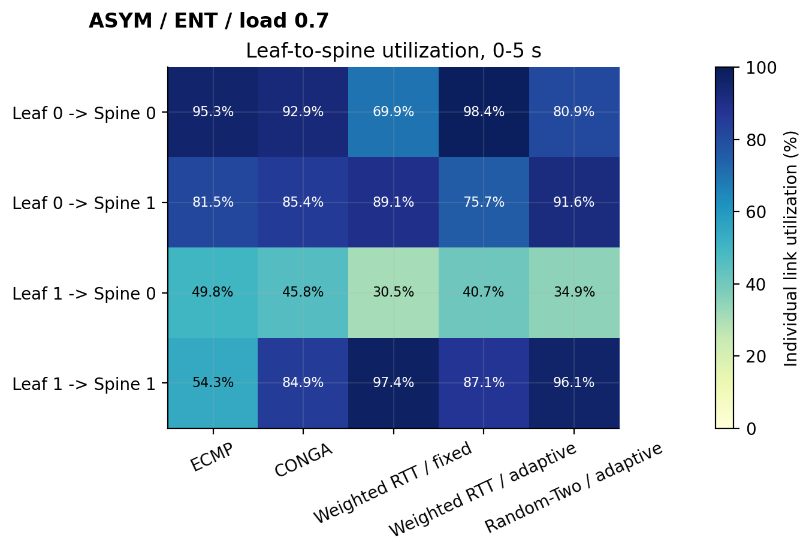

[SVG version](asym/load_7/uplink_utilization.svg)

### ASYM / load 0.7: Per-load FCT tail

The complementary CDF shows the fraction with application FCT strictly greater than the horizontal value, using logarithmic axes. At a fixed threshold, lower means fewer flows exceed it. The dotted 0.01 reference marks a one-percent tail. Ties are counted together and the zero-probability endpoint is omitted; a curve ending before another is not an incomplete transfer. Sample counts are shown, and the ordinary CDF remains available alongside this view.

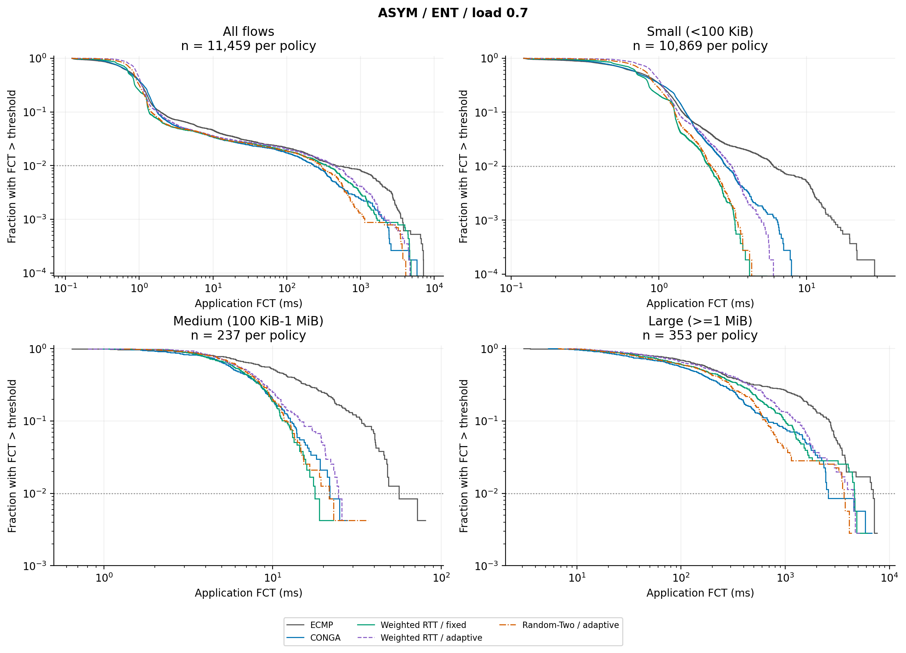

[SVG version](asym/load_7/fct_tail.svg)
